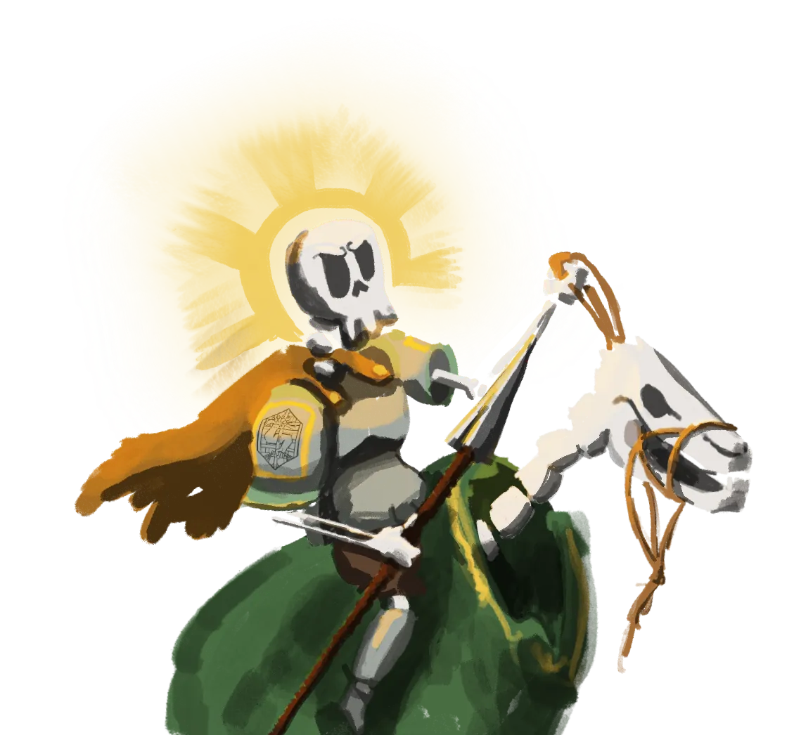

# Agustin of Carzagus

{ .wiki-infobox-img }

Agustin of Carzagus

Baker · Lakobordo

<dl>
<dt>Role</dt><dd>Baker</dd>
<dt>Location</dt><dd>Lakobordo</dd>
<dt>Status</dt><dd>Active</dd>
</dl>

Famous throughout [Lakobordo](../regions/villages/lakobordo.md) for his extraordinary croissants. Also, for an old silver pendant shaped like a fist that he carries everywhere, a pendant he cannot explain, and whose origin even he does not know.

He is a kind, unassuming man who seems entirely unlikely to be important.

## The Pendant

The pendant is silver, old, and shaped like a closed fist. It shows no maker's mark that any smith in [Lakobordo](../regions/villages/lakobordo.md) has been able to identify. Those with knowledge of rare magical artifacts have taken an unusual interest in it.

