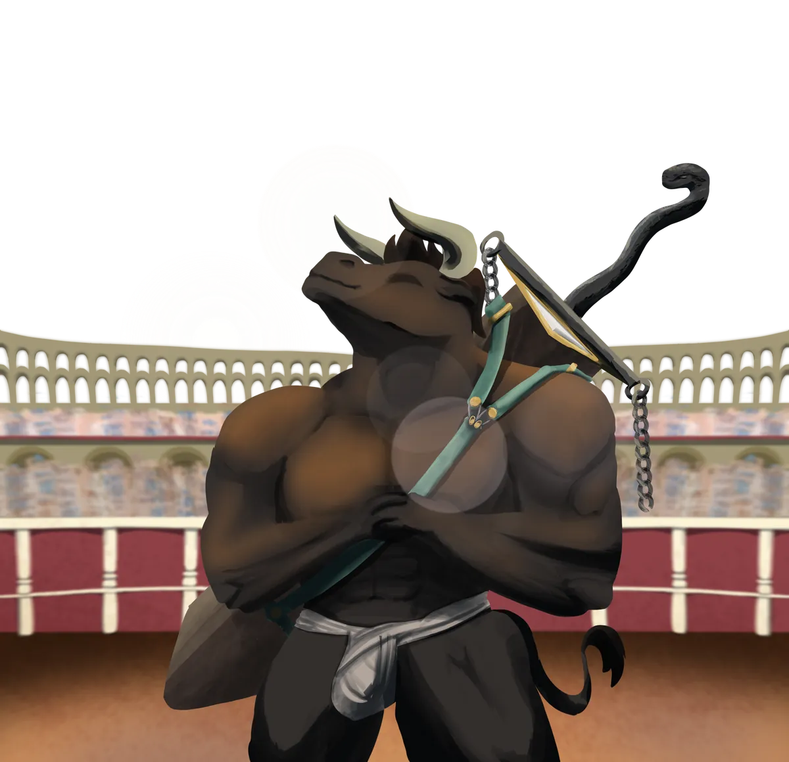

# Zack "The Blade" Armada

{ .wiki-infobox-img }

Armada

Champion of the Colosseum · Brave Consul of An'Ramoda

<dl>
<dt>Role</dt><dd>Brave Consul of An'Ramoda · Colosseum Champion</dd>
<dt>Location</dt><dd>An'Ramoda</dd>
<dt>Status</dt><dd>Active</dd>
</dl>

A towering black minotaur with sharp horns and a massive blade worn across his back, a blade no one has ever seen him draw. Reigning Colosseum champion for more than ten years, and one of the three consuls of An'Ramoda, chosen personally by the goddess [Aremedia](../gods/aremedia.md).

## The Colosseum

Challengers come from across Galluvinchia seeking glory. None has forced him to draw his sword. Whether this is patience, mercy, or something else entirely is a matter of ongoing debate.

## Politics

As Brave Consul, Armada represents martial valor in An'Ramoda's governance. Alongside [Lewis Pendeltag](lewis-pendeltag.md) and [Martin Goldberg](martin-goldberg.md), he forms the triumvirate that implements Aremedia's will.

!!! tip "Rumour"
    Fighters defeated at the Colosseum are yet to be seen again. Their families accept that whatever happens is glory or death, but not everyone is so certain.

