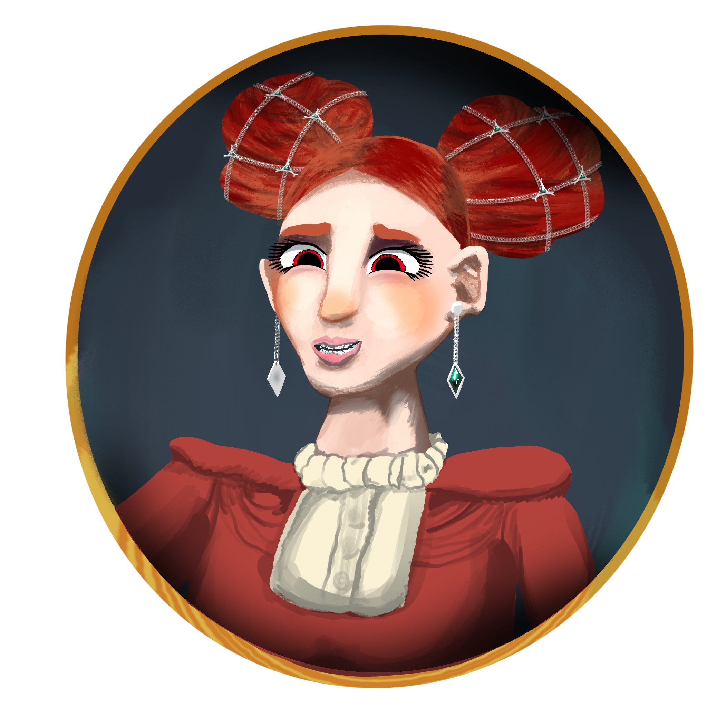
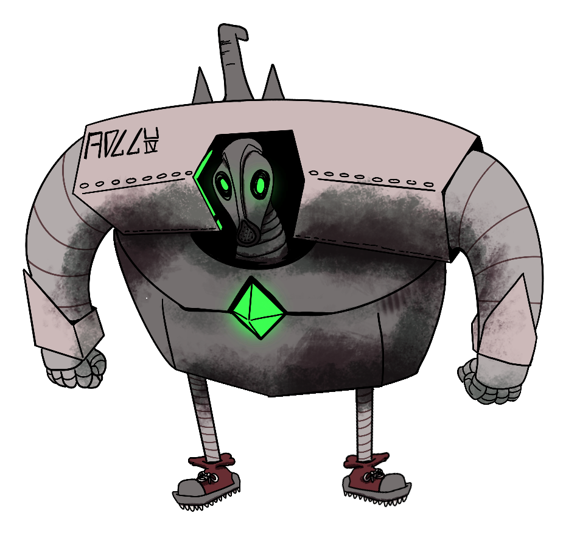
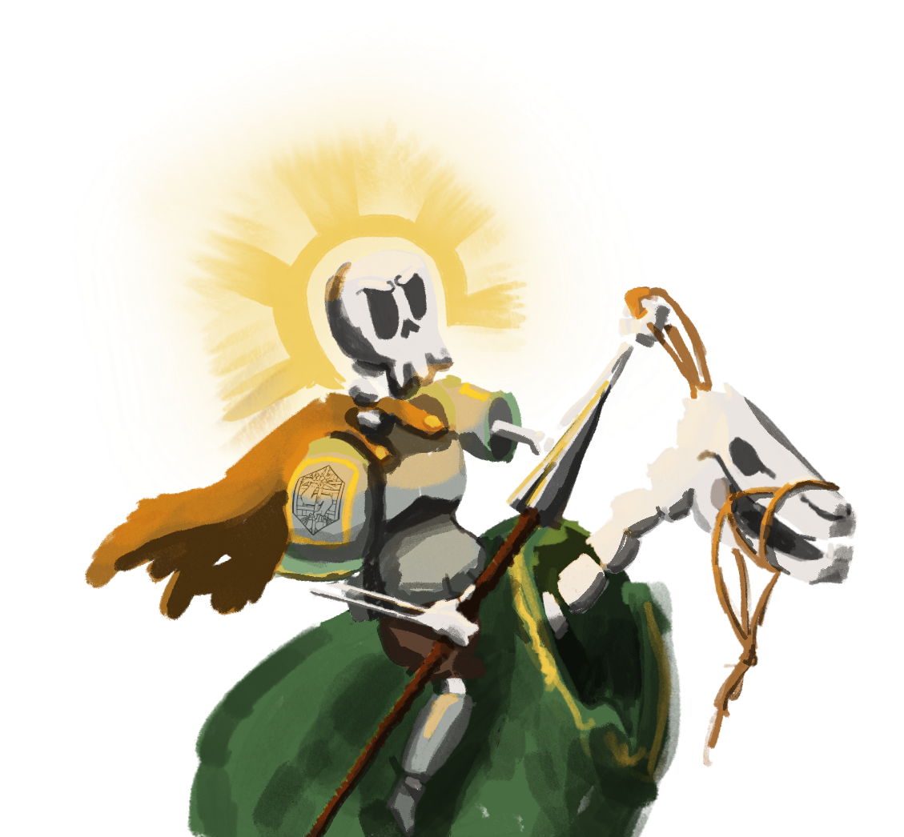

# Personajes de Galluvinchia

Galluvinchia está moldeada tanto por individuos como por dioses o geografía. Este es un registro de quienes dejaron huella, héroes, gobernantes, eruditos, campeones y los extraordinariamente discretos.

---

## Gobernantes y Líderes

### Aremedia
*Diosa del Ímpetu · Gobernante de An'Ramoda*

Aunque es una diosa, Aremedia es la más frecuentemente vista de todos los divinos en Galluvinchia. Quienes la han contemplado describen electricidad corriendo por su largo cabello dorado, una figura muy esbelta y alta siempre vestida con armadura, con una rama de olivo coronando su presencia.

Gobierna An'Ramoda directamente, eligiendo a sus cónsules por juicio personal y exigiendo que la ciudad refleje sus valores de fuerza, honor y esfuerzo incesante.

---

### Lewis «El Recaudador» Pendeltag
*Cónsul Sabio de An'Ramoda*

Uno de los tres cónsules elegidos por la propia Aremedia. Conocido por su vasta colección de objetos mágicos y su conocimiento enciclopédico de la historia de Galluvinchia. También gestiona la recaudación de impuestos de la ciudad, una combinación de sabiduría y riqueza que lo convierte en una de las personas más influyentes de la tierra.

---

### Zack «La Espada» Armada
*Campeón del Coliseo · Cónsul Valiente de An'Ramoda*

{ .wiki-portrait }

Un enorme minotauro negro de afilados cuernos y una gran espada a su espalda, una espada que nadie le ha visto jamás desenfundar. El campeón reinante del Coliseo durante más de diez años, y uno de los tres cónsules de An'Ramoda. Si lleva su autoridad política con la misma facilidad que su invicto historial es materia de debate.

---

### Martin «La Moneda» Goldberg
*Cónsul Poderoso de An'Ramoda*

Propietario de la mina de oro de An'Ramoda, y el tercero de los cónsules elegidos por la diosa. El comercio y las monedas son su dominio, y en una ciudad donde la mina lo impulsa todo, su poder es considerable.

---

### Rey Fernando Oldreekia
*Rey de la Dama de Mármaros*

Real por sangre, la familia Oldreekia ha ostentado el poder en la Dama de Mármaros desde antes de que los dioses pusieran pie en estas tierras. Fernando gobierna junto a la Academia y el Gremio, aunque el equilibrio de ese triángulo nunca es del todo estable.

---

### El Rey sin Melena
*Amado Gobernante de Lorda Gorda*

{ .wiki-portrait }

El Rey sin Melena ha sido siempre un rey bondadoso que vela por su población. Ostenta cuatro de los diez puntos de voto en la asamblea de Lorda Gorda, una posición poderosa pero no sin control. La gente de Lorda Gorda genuinamente lo ama, lo cual, en un mundo de gobernantes ambiciosos, es más raro de lo que parece.

---

## Eruditos y Magos

### Magistrada Mónica Mars
*Directora de la Academia de Magias Maravillosas · Dama de Mármaros*

{ .wiki-portrait }

Una de las magas más hábiles e inteligentes de Galluvinchia. Bajo su liderazgo, la Academia de Magias Maravillosas ha crecido de institución a marca pública, sus productos vistos en cada ciudad. Si esto la convierte en una visionaria o simplemente en alguien muy bueno en los negocios depende de a quién se le pregunte. De cualquier manera, es una de las personas más poderosas de Mármaros.

---

### Merrion Meyer
*Regente de la Academia de las Ondas Étereas y los Sueños · Doormi*

Merrion Meyer dirige la academia más humilde pero de espíritu generoso en Doormi. Donde Mónica Mars construye imperios, Merrion construye oportunidades, el primer año de estudio es gratuito para los estudiantes más brillantes, independientemente de su origen.

---

## Figuras Históricas

### Salgu, Rey de las Bestias
*Primera Era · Fundador de An'Ramoda*

En la Era de los Gigantes, Salgu construyó la ciudad de An'Ramoda como santuario donde humanos, centauros y minotauros pudieran vivir seguros dentro de sus altas murallas. También es el origen del nombre del linaje minotauro, se decía que el primer minotauro era el propio hijo de Salgu.

---

### Lumin Oldreekia
*El Gran Leokin · Fundador de Lorda Gorda*

El mayor héroe de los felicios, Lumin Oldreekia fue el legendario líder que creó la primera ciudad felicia, ahora llamada el Whisk de Lumin, en la costa sur de Galluvinchia. Más tarde se convirtió en el primer rey de Lorda Gorda. Siglos después, el Whisk resiste contra tormentas de arena, piratas y necrófagos, sus torres aún en pie como su legado.

---

### Raquel Crepusculiento
*La Última Inventora · Academia Perdida de Carbohyrr*

{ .wiki-portrait }

La última inventora conocida de una academia hace tiempo olvidada conectada al Señor de Carbohyrr. Sus planos y notas sobreviven en lugares ocultos, detallando diseños y conocimientos que la era actual aún no ha igualado. Su creación más notable se menciona en las leyendas, pero la verdad de ella permanece enterrada.

---

### Archlich Kogarashi
*El Nigromante · Enemigo de los Dioses*

{ .wiki-portrait }

Fue en su día un archimago de furia y ambición sin par. Tras el ascenso de los dioses a la divinidad, los denunció como usurpadores de los tronos divinos e ignorantes de las artes arcanas. Forjó un pacto con un cónclave de poderosos magos y libró la **Guerra Arcana** contra el nuevo orden divino.

Panos triunfó, pero el cuerpo de Kogarashi nunca fue encontrado. Escondido en algún lugar de las profundidades de Ancho Groncho, el laberíntico territorio que él mismo creó, su destino permanece desconocido. Su legado nigromante sigue inquietando a los vivos.

---

## Personajes Notables

### Agustín de Carzagus
*Panadero · Lakobordo*

{ .wiki-portrait }

Famoso en todo Lakobordo por sus extraordinarios croissants. También, por un viejo colgante de plata con forma de puño que lleva siempre consigo, un colgante que no puede explicar y cuyo origen ni él mismo conoce. Es un hombre amable y discreto que parece del todo improbable que sea importante.

---

### Alice Rockwool
*Aventurera · Leyenda de la Biblioteca de Lakobordo*

Viajando por las profundidades bajo Lakobordo, según la leyenda, Alice Rockwool y sus compañeros descubrieron una biblioteca atemporal sepultada bajo el pálido polvo de la turmalina. Un autómata de inmensas proporciones los aguardaba. Antes de que la batalla comenzara, ella dio un paso al frente y declaró:

> *"¡Ríndete ante la espada de tus maestros! ¡Mírala!"*

Y el autómata se arrodilló.

---

### Silvino
*Gran Paladín de Panos*

{ .wiki-portrait }

Uno de los campeones más devotos de Panos, Silvino sirve al dios de la magia y el orden. Su misión consiste en recuperar reliquias perdidas por su divinidad distraída, objetos que Panos cree importantes pero ya no recuerda exactamente por qué.