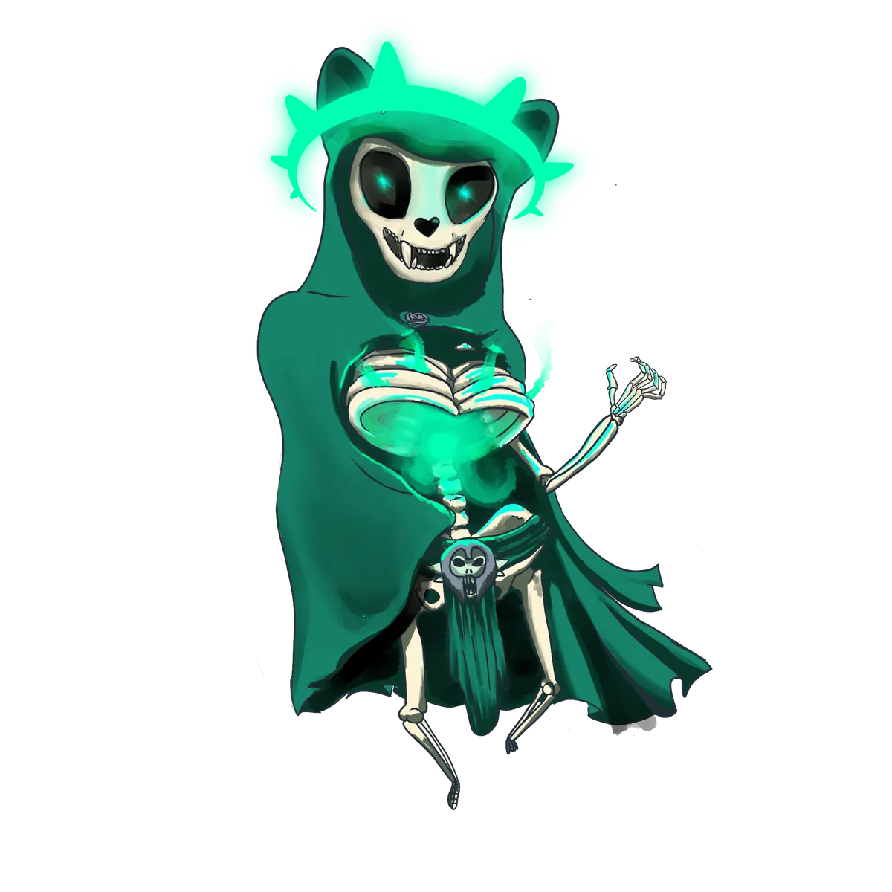

# Archliche Kogarashi

{ .wiki-infobox-img }

Archliche Kogarashi

El Nigromante · Enemigo de los Dioses

<dl>
<dt>Rol</dt><dd>Archimago · Nigromante</dd>
<dt>Última ubicación conocida</dt><dd>Ancho Groncho</dd>
<dt>Estado</dt><dd>Desconocido — cuerpo nunca encontrado</dd>
<dt>Conflicto</dt><dd>Guerra Arcana</dd>
</dl>

En su día un archimago de furia y ambición sin par, Kogarashi emergió tras el ascenso de los dioses y los denunció como usurpadores. Forjó un pacto prohibido con un cónclave de poderosos magos y libró la **Guerra Arcana** contra el nuevo orden divino.

## La Guerra Arcana

La guerra sacudió Galluvinchia. Su enfrentamiento final estalló en **Ancho Groncho**, un laberinto que el propio Kogarashi había creado. [Panos](../gods/panos.md) triunfó, pero el cuerpo de Kogarashi nunca fue encontrado.

!!! warning "Peligro"
    Las Terceras Guerras de los Esqueletos terminaron hace tres años. Pero el cuerpo del nigromante nunca fue encontrado, y los no-muertos siguen inquietos.

