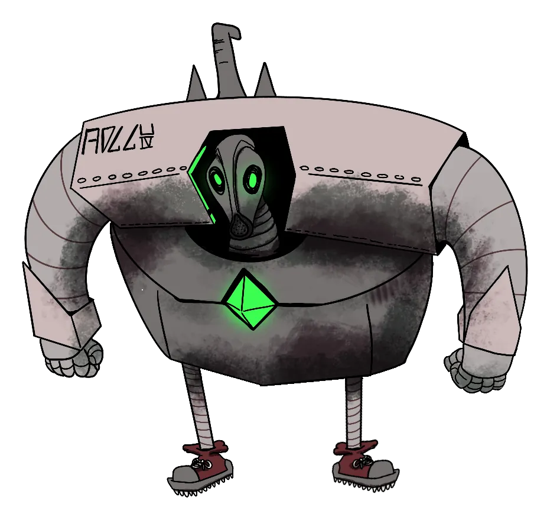

# Raquel Crepusculiento

{ .wiki-infobox-img }

Raquel Crepusculiento

The Last Inventor · Lost Academy of Carbohyrr

<dl>
<dt>Role</dt><dd>Inventor</dd>
<dt>Location</dt><dd>Lord of Carbohyrr (historical)</dd>
<dt>Status</dt><dd>Unknown</dd>
</dl>

The last known inventor of a long-forgotten academy connected to the Lord of Carbohyrr. Her blueprints and notes survive in hidden places, detailing designs and knowledge that the current age has yet to match.

## Legacy

Her most notable creation is spoken of in legends among the smiths and battlemages of Carbohyrr, but the truth of it remains buried. Scholars who have found fragments of her notes speak of machines that should not exist and formulas that defy current understanding of the Ripple.

