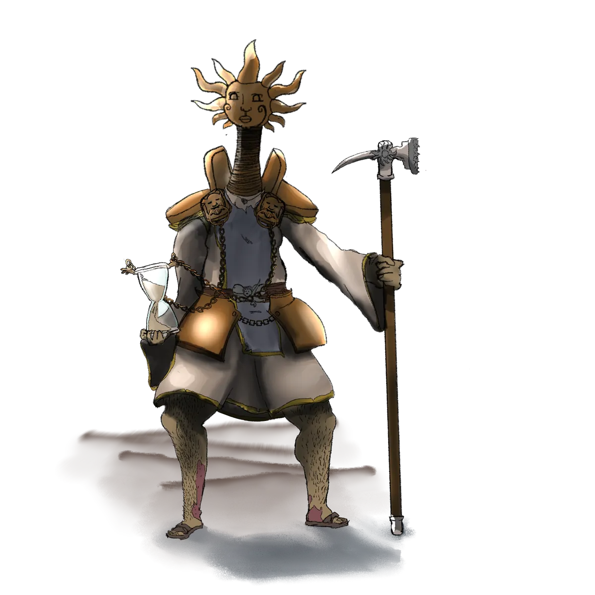

# Silvino

{ .wiki-infobox-img }

Silvino

High Paladin of Panos

<dl>
<dt>Role</dt><dd>High Paladin of Panos</dd>
<dt>Location</dt><dd>Wandering</dd>
<dt>Status</dt><dd>Active · On a quest</dd>
</dl>

One of Panos's most devoted champions, Silvino serves the god of magic and order with absolute dedication. His current quest involves the recovery of relics lost by his absentminded deity, objects that Panos believes are important but can no longer remember exactly why.

## The Quest

[Panos](../gods/panos.md) is known for his capricious nature and faltering memory. Relics of divine significance have been misplaced across Galluvinchia over the centuries. Silvino travels the land recovering them, believing each one restored strengthens Panos's divine memory.

