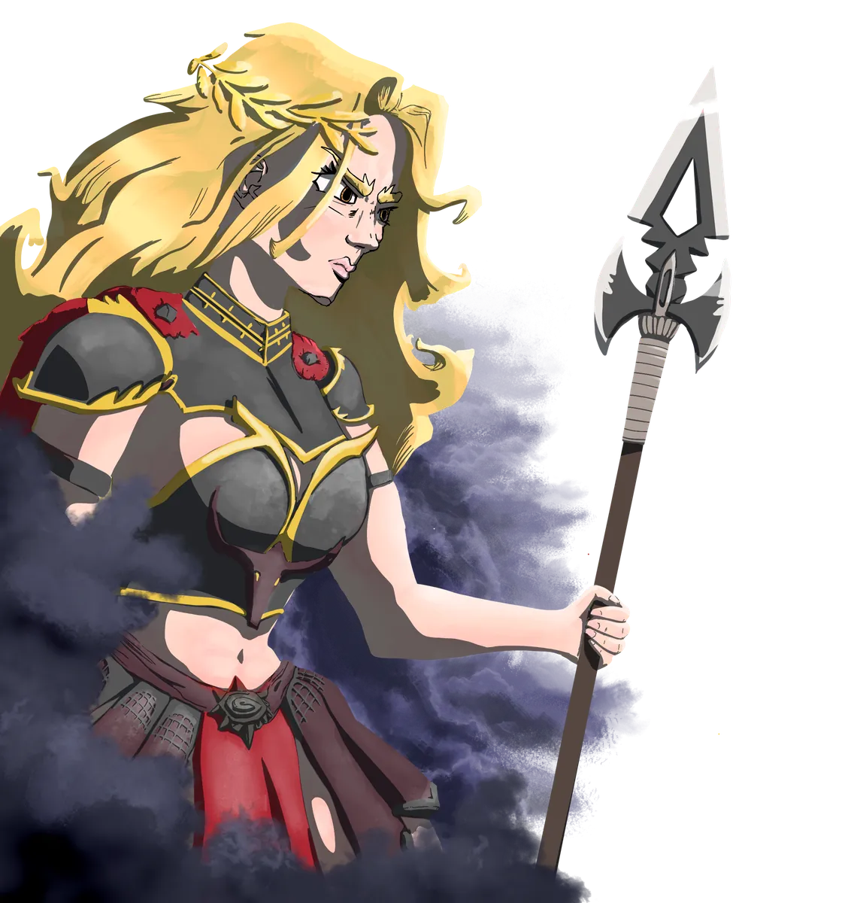

# Aremedia

> *"The boon is earned, never given. Strive, and I will meet you at the edge."*

{ .wiki-infobox-img }

Aremedia

The Edge

{ .wiki-infobox-emblem }

<dl>
<dt>Titles</dt><dd>Goddess of Impetus</dd>
<dt>Domains</dt><dd>War, Strength, Effort</dd>
<dt>Seat</dt><dd>An'Ramoda</dd>
<dt>Parents</dt><dd>Panos and Brenadette</dd>
<dt>Champion</dt><dd>Armada, the Colosseum Champion</dd>
<dt>Worshipers</dt><dd>Soldiers, gladiators, laborers</dd>
<dt>Classes</dt><dd>Paladin, Warrior, Rogue, Monk, Barbarian, Sorcerer, Ranger</dd>
</dl>

Aremedia is the first daughter of [Panos](panos.md) and [Brenadette](brenadette.md), and she inherited all the energy of the world. She is the most frequently *seen* of all the gods. Those who have laid eyes upon her describe electricity running through her long golden-like hair, a lean and tall figure, always armored, an olive branch crowning her presence.

## Description

She promotes striving, fighting, and working hard above all else. The harder people work, the more they receive her boon. Her faith is the creed of An'Ramoda itself: strength, honor, and relentless effort.

## Domain

She rules over **An'Ramoda**, the most powerful military city in Galluvinchia, and commands the mightiest army on the continent. Her champion, **Armada**, has held the title of Colosseum Champion for more than ten years. Her achievements are celebrated yearly in the Colosseum with great gladiatorial games.

!!! quote "Suggested classes"
    Paladin, warrior, rogue, monk, barbarian, sorcerer, ranger

{ .wiki-full }
