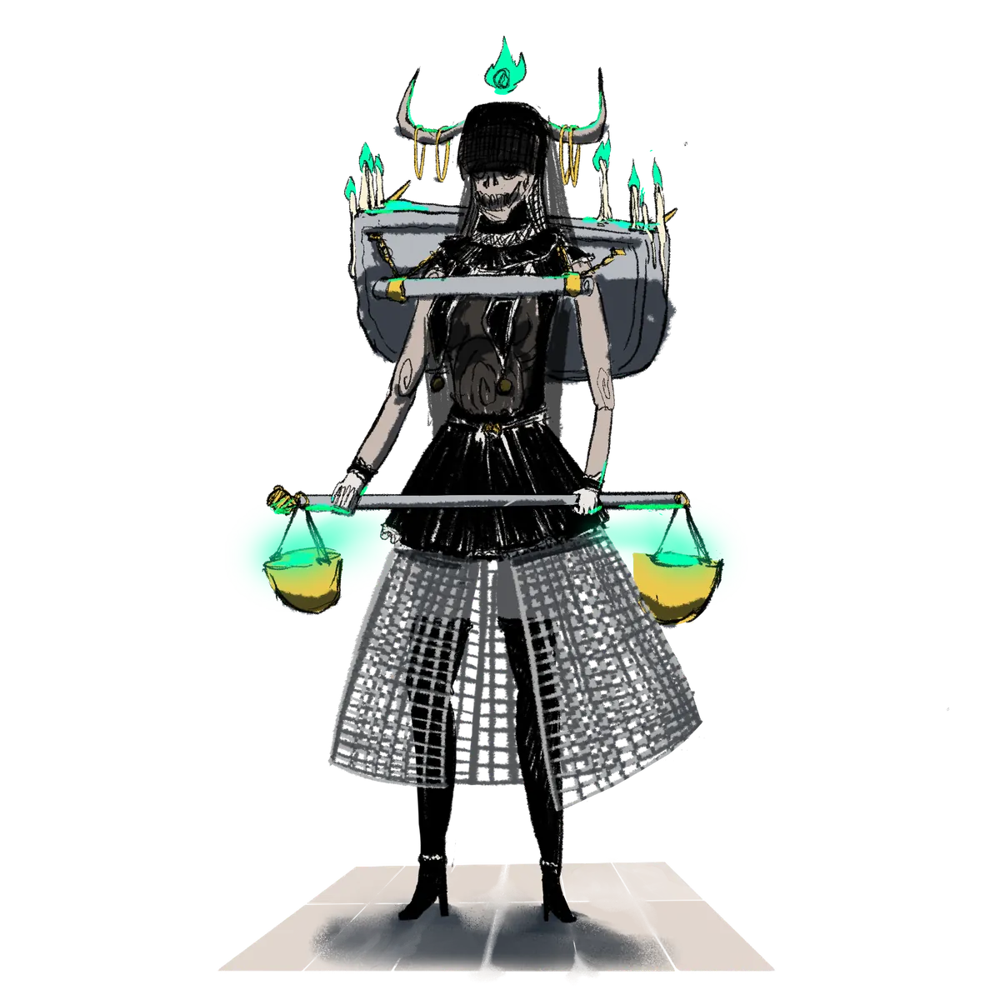

# Brenadette

> *"El sueño es un lujo de los vivos. Entregué el mío para que el vuestro pudiera terminar, y comenzar de nuevo."*

{ .wiki-infobox-img }

Brenadette

Guardiana del Ciclo de la Vida

{ .wiki-infobox-emblem }

<dl>
<dt>Títulos</dt><dd>Diosa del Rencarnatorno, Diosa de la Tempestad</dd>
<dt>Dominios</dt><dd>Muerte, el Ciclo de la Vida, Tormentas</dd>
<dt>Sede</dt><dd>La Gran Abadía de Pharoes</dd>
<dt>Consorte</dt><dd>Panos</dd>
<dt>Hijas</dt><dd>Aremedia, Morphia</dd>
<dt>Fieles</dt><dd>Fervientes y secretos</dd>
<dt>Clases</dt><dd>Brujo, Clérigo, Pícaro, Mago</dd>
</dl>

Brenadette es irritable y temperamental, y quizás se ha ganado esa reputación. Su eterna labor como preservadora del Ciclo de la Vida la mantiene siempre despierta, atada para siempre al reino de los muertos. Sacrificó el sueño, y quizás la paz, para que las almas de los vivos pudieran continuar y renacer.

## Culto

Sus seguidores son algunos de los más fervientes de Galluvinchia. Sus prácticas están envueltas en misterio, regidas por normas estrictas y marcadas por ocasionales sacrificios de sangre. Creen que cada acto de devoción puede calmar una tormenta furiosa o atraer bancos de peces hacia las costas.

La Abadía más grande dedicada a ella se encuentra en **Pharoes**, una ciudad frecuentemente azotada por tormentas. Allí los lugareños la veneran no solo como guardiana de los muertos sino también como la **Diosa de la Tempestad**.

!!! warning "Fe oscura"
    Muchos de sus seguidores ven a Brenadette como justificación para sus actos más oscuros. Bandas, violencia y ambiciones siniestras se cobijan bajo su nombre.

## Relaciones

Brenadette se enamoró de [Panos](panos.md) durante sus años en la academia, y juntos alcanzaron la divinidad. Es madre de [Aremedia](aremedia.md) y [Morphia](morphia.md). Su vigilia eterna sobre el Rencarnatorno es la tristeza que Panos aún recorre el mundo esperando sanar.

!!! quote "Clases sugeridas"
    Brujo, clérigo, pícaro, mago

{ .wiki-full }
