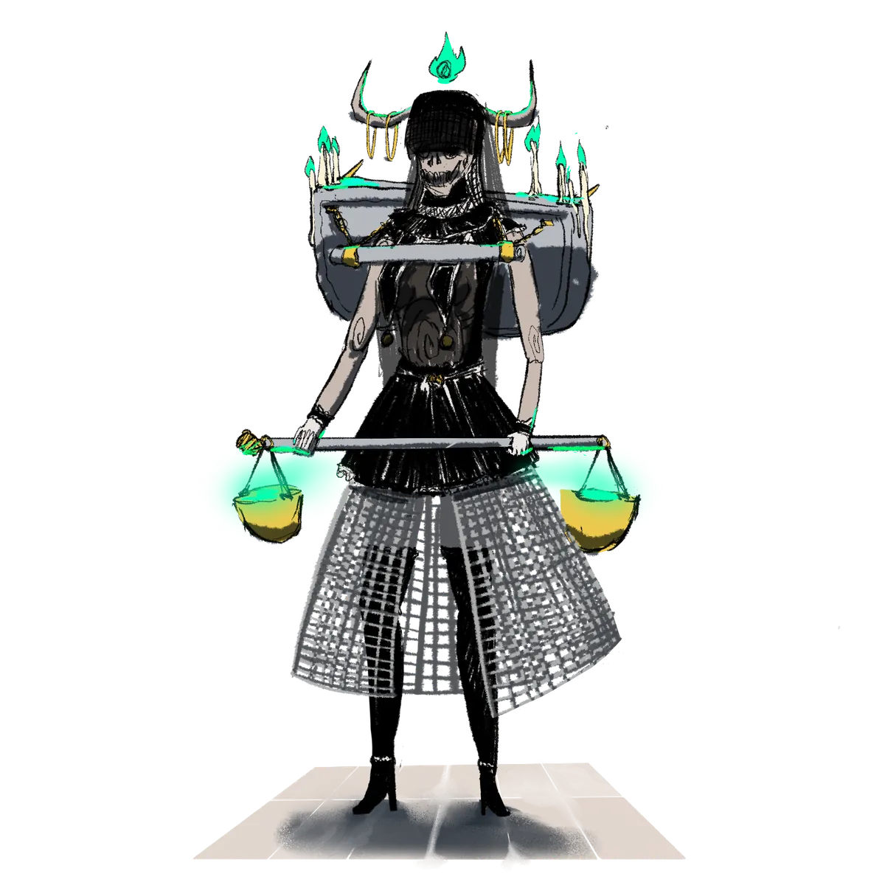

# Brenadette

> *"Sleep is a luxury of the living. I gave mine so that yours could end, and begin again."*

{ .wiki-infobox-img }

Brenadette

Keeper of the Life Cycle

{ .wiki-infobox-emblem }

<dl>
<dt>Titles</dt><dd>Goddess of the Neverender, Goddess of the Tempest</dd>
<dt>Domains</dt><dd>Death, the Life Cycle, Storms</dd>
<dt>Seat</dt><dd>The Great Abbey of Pharoes</dd>
<dt>Consort</dt><dd>Panos</dd>
<dt>Children</dt><dd>Aremedia, Morphia</dd>
<dt>Worshipers</dt><dd>Fervent and secretive</dd>
<dt>Classes</dt><dd>Warlock, Cleric, Rogue, Wizard</dd>
</dl>

Brenadette is tetchy and temperamental, and perhaps she has earned that reputation. Her eternal duty as preserver of the Cycle of Life keeps her always awake, forever bound to the realm of the dead. She sacrificed sleep, and perhaps peace, so that the souls of the living could pass on and be reborn.

## Worship

Her followers are some of the most fervent in Galluvinchia — their practices shrouded in mystery, governed by strict rules, and marked by occasional blood sacrifice. The largest abbey stands in **Pharoes**, where she is revered not only as keeper of the dead but also as the **Goddess of the Tempest**.

!!! warning "Dark faith"
    Many of her followers see Brenadette as justification for harsh deeds. Gangs, violence, and darker ambitions shelter themselves beneath her name.

## Relationships

Brenadette fell in love with [Panos](panos.md) during their academy years, and together they achieved divinity. She is mother to [Aremedia](aremedia.md) and [Morphia](morphia.md). Her endless vigil over the Neverender is the sorrow that Panos still wanders the world hoping to mend.

{ .wiki-full }
