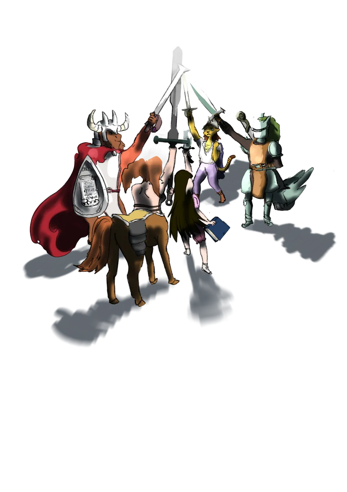
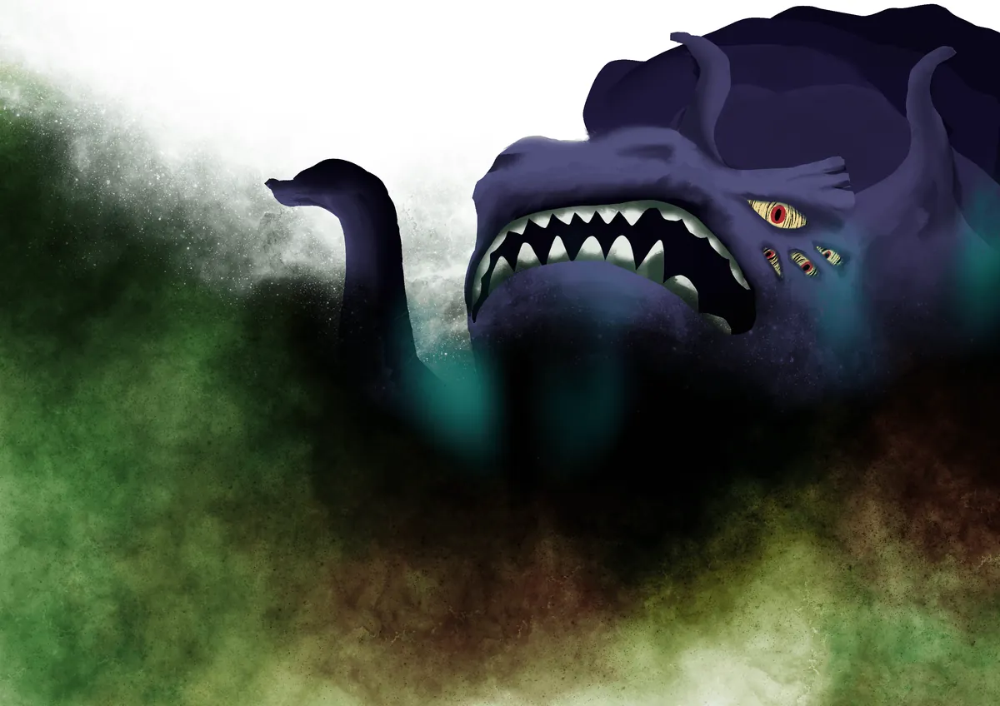

# Los Dioses de Galluvinchia

{ .wiki-portrait }

En Galluvinchia, los dioses no son mitos, son vecinos.

Fueron en su día héroes mortales que surgieron de las grandes academias de Galluvinchia, vencieron a los titanes primordiales y ascendieron a la divinidad. Su humanidad no desapareció con su apoteosis, quedó *magnificada*. Aman con fiereza, sufren profundamente y cargan con defectos tan antiguos como el propio mundo.

La fe en Galluvinchia es pragmática. Al igual que los antiguos romanos, los ciudadanos honran a sus deidades mientras persiguen objetivos prácticos, invocando el favor divino para batallas, cosechas o el comercio. Ser devoto da forma a quién eres: los seguidores de Aremedia valoran la fuerza y la ley del más fuerte; los seguidores de Morphia prefieren una vida tranquila y la búsqueda del conocimiento.

La energía de los dioses se alimenta de las acciones de sus creyentes, y del poder que alcanzaron a lo largo de su vida mortal.

---

## El Panteón

### Panos
*Guardián del Ritmo y la Magia · Dios de la Vida y el Orden*

{ .wiki-emblem }

Panos es el más antiguo y quizás el menos adorado de las cuatro deidades principales, pero su poder subyace a todo lo demás. Cree que el ritmo y la melodía son el latido de la existencia, que la propia magia pulsa al compás de un canto cósmico.

Sus seguidores son pocos pero profundamente devotos, preservando antiguos bailes y canciones casi olvidadas como actos de fe. De una manera casi irónica, el ferviente ritmo de su devoción lo convierte en el dios del orden y de la vida, del flujo de la magia y del orden natural de toda la existencia.

Panos es conocido por su **naturaleza caprichosa e inexistente memoria**, perdiendo con frecuencia objetos de significado sentimental o mágico. Sus devotos emprenden misiones eternas para recuperar estas reliquias perdidas, creyendo que cada hallazgo restaura parte de su memoria divina y su poder.

Sus fanáticos más fervorosos esconden sus rostros tras **máscaras con forma de sol**, creyendo que Panos arrastra el astro desde el horizonte cada día para que los mortales tengan claridad.

!!! quote "Clases sugeridas"
 Bardo, clérigo, monje, mago

{ .wiki-full }

---

### Brenadette
*Guardiana del Ciclo de la Vida · Diosa del Rencarnatorno*

{ .wiki-emblem }

Brenadette es irritable y temperamental, y quizás se ha ganado esa reputación, su eterna labor como preservadora del Ciclo de la Vida la mantiene siempre despierta, atada para siempre al reino de los muertos. Sacrificó el sueño, y quizás la paz, para que las almas de los vivos pudieran continuar y renacer.

Sus seguidores son algunos de los más fervientes de Galluvinchia. Sus prácticas están envueltas en misterio, regidas por normas estrictas y marcadas por ocasionales sacrificios de sangre. Creen que cada acto de devoción puede calmar una tormenta furiosa o atraer bancos de peces hacia las costas.

La Abadía más grande dedicada a ella se encuentra en **Pharoes**, una ciudad frecuentemente azotada por tormentas. Allí los lugareños la veneran no solo como guardiana de los muertos sino también como la **Diosa de la Tempestad**.

!!! warning "Fe oscura"
 Muchos de sus seguidores ven a Brenadette como justificación para sus actos más oscuros, bandas, violencia y ambiciones siniestras se cobijan bajo su nombre.

!!! quote "Clases sugeridas"
 Brujo, clérigo, pícaro, mago

{ .wiki-full }

---

### Aremedia
*El Filo · Diosa del Ímpetu*

{ .wiki-emblem }

Aremedia es la primera hija de Panos y Brenadette, y heredó toda la energía del mundo. Es la más frecuentemente *vista* de todos los dioses, quienes han sido bendecidos con su presencia cuentan que pueden ver electricidad corriendo por su largo cabello dorado, una figura muy esbelta y alta, siempre con su armadura y una rama de olivo coronando su presencia.

Esforzarse, luchar, trabajar duro es todo lo que promueve. Cuanto más duro trabajen las personas, más recibirán su bendición.

Gobierna **An'Ramoda**, la ciudad militar más poderosa de Galluvinchia, y comanda el ejército más formidable del continente. Su campeón, **Armada**, lleva más de diez años ostentando el título de Campeón del Coliseo. Sus logros se celebran cada año en el Coliseo con grandes juegos de gladiadores.

!!! quote "Clases sugeridas"
 Paladín, guerrero, pícaro, monje, bárbaro, hechicero, explorador

{ .wiki-full }

---

### Morphia
*La Pensadora · Guardiana de los Sueños · Diosa del Amor y los Secretos*

{ .wiki-emblem }

Morphia es tímida y retraída, y a menudo se pierde en sus propios sueños, lo que deja a sus seguidores sin su gracia durante períodos conocidos como el **Letargo de Morphia**. Aun así, su santuario en Doormi, junto a sus cascadas, atrae a artistas, médicos y buscadores de crecimiento interior de toda la tierra.

Sus seguidores son muy pacíficos, pero a menudo se entregan en exceso a los placeres de la carne, las drogas o el alcohol. Para mantener el equilibrio, instituyó la **Orden de los Durmientes**, guardianes que guían a los fieles lejos del hedonismo y hacia el estoicismo y la armonía interior.

Presta su poder a la **Academia de las Ondas Étereas y los Sueños**, donde los artesanos usan el Telar de los Sueños para tejer prendas mágicas.

Morphia también compartió su poder divino generosamente, elevando tanto a **Leeve** como a **Moroes** a la divinidad, aunque las relaciones que siguieron no estuvieron exentas de dolor.

!!! quote "Clases sugeridas"
 Paladín, mago, hechicero, druida, bardo

{ .wiki-full }

---

### Moroes
*Dios de la Forja · Patrón del Señor de Carbohyrr*

{ .wiki-emblem }

En lo más profundo del Señor de Carbohyrr, el tintineo de un yunque resuena por sus cavernas como el sonido del ominoso campanario de una catedral. Ese sonido es Moroes, y no ha cesado desde que el mundo era joven.

Se dice que su maestría artesanal no tiene igual. Las leyendas cuentan que forjó las propias herramientas usadas para alcanzar la divinidad. Pero ahora está recluido, guiado por susurros que se arrastran en su mente, perfeccionando su habilidad en soledad, creando objetos mágicos legendarios que ningún otro puede igualar.

Sus seguidores, herreros, escultores, trabajadores del cuero, joyeros, buscan crear la mejor obra posible. Ser el patrón de Carbohyrr convierte a la ciudad en un lugar muy rico en toda clase de oficios.

!!! note "Un corazón de hierro"
 Moroes amó profundamente a Morphia, entregando herramientas divinas a sus padres a cambio de su mano. Cuando se alcanzó la divinidad, la boda fue cancelada. El latido de su yunque, dicen, es lo único que puede detener el dolor de su corazón roto.

!!! quote "Clases sugeridas"
 Bárbaro, mago, guerrero, clérigo

{ .wiki-full }

---

### Leeve
*Diosa de la Belleza y la Naturaleza*

{ .wiki-emblem }

Leeve es la más joven de los dioses, elevada a la divinidad por la propia Morphia. Se la representa de innumerables maneras, quienes no la conocen pueden abrazarla como la simple diosa de la belleza, llegando incluso a entregarse a su propia vanidad. Pero quienes han estado en su presencia comprenden que la belleza puede ser inquietante, y que la verdadera belleza se encuentra en la naturaleza y el equilibrio.

Es amada por la gente de la **Joya Siemprecreciente**, que vive bajo la sombra del Primer Árbol que ella protege.

Aunque criada como paladín, Leeve también domina lo arcano, con vocación por la magia de la naturaleza, una intelectual forjada por la adversidad y la amistad.

!!! quote "Clases sugeridas"
 Bardo, mago, clérigo, druida

{ .wiki-full }

---

## La Conexión Entre los Dioses

Brenadette y Panos se conocieron en una de las grandes academias de Galluvinchia y se enamoraron perdidamente el uno del otro. Cuando terminaron sus estudios, Brenadette esperaba a su primera hija: **Aremedia**. No mucho después llegó **Morphia**, y fue entonces cuando ambos padres decidieron dejar un mundo mejor, especialmente para su familia. Alcanzaron la divinidad juntos y se convirtieron en los protectores y gobernantes de Galluvinchia.

**Moroes** les ayudó a alcanzar ese objetivo. Años después, Morphia comenzó una relación con él, pero no duró. El yunque fue reemplazado por la locura, y **Morphia** abandonó el abrazo de **Moroes**.

De su profunda tristeza, el trono del amor quedó vacío. Pero uno de sus paladines nunca perdió la esperanza. La persiguió, incluso en sus pesadillas. Cuando la diosa regresó, había salvado el amor y encontrado la paz, y como parte del amor infinito de Morphia, fue elevada a la divinidad: **Leeve**, la diosa de la belleza y la naturaleza.

---

## Otros Entes Poderosos

No todos los seres poderosos de Galluvinchia están entre los seis dioses. Algunos son antiguos, algunos están ocultos y de algunos es mejor no hablar demasiado alto.

### La Luz
Muchos galluvinchianos rezan a la Luz en lugar de a un dios concreto. Los seguidores de la Luz tienden a ser nobles, ingenuos y optimistas, ligados por juramentos de claridad y honestidad.

> *"La Luz revela el camino."*
> *"La Luz no brilla en la oscuridad."*

### La Voluntad de lo Salvaje
{ .wiki-portrait }

Desde tiempos inmemoriales, el poder de la naturaleza ha sido custodiado por la Voluntad de lo Salvaje. Sus venas son las raíces de todos los árboles de Galluvinchia, y es la guardiana eterna de **Aurora Densasilva**, el bosque perpetuo. Sus caminos pueden ser inquietantes o incluso retorcidos, pero protegerá la naturaleza para siempre, de una forma u otra.

### Los Paladines Olvidados
{ .wiki-portrait }

Deambulando por las ruinas de Galluvinchia, los ecos de paladines perdidos en el tiempo flotan como ángeles al servicio de la justicia. Buscan caballeros para elevar a un nuevo paladín que pueda hacer de la libertad su escudo y de la justicia su espada.

### La Estrella Deslustrada
{ .wiki-portrait }

En tierras lejanas, caminantes del abismo, mitad tiburón, mitad persona, atraen almas de lugares remotos e invaden reinos con un poder descomunal. Su emperatriz, la Estrella Deslustrada, ostenta el poder de muchos mundos. Observa, espera y busca heraldos que le permitan visitar y gobernar.

### El Innombrable
{ .wiki-portrait }

Nadando por el universo, el Innombrable desea el colapso de toda la existencia, consumir toda vida, quizás por odio, quizás buscando la paz cuando toda la luz se haya apagado. El creador del vacío y portador de la tristeza, viaja incansable por el espacio y el tiempo.

### La Dama de Astas
En las profundidades bajo el Señor de Carbohyrr, la voz que enloqueció a Moroes provenía de una mujer, la Dama de Astas. De origen e intenciones desconocidas, sus oscuros planes solo pueden ser escuchados por Moroes y seguidos por quienes sean lo suficientemente valientes, o locos, para firmar un pacto con ella.

### Los Dragones Perdidos
{ .wiki-portrait }

Parte de la fantasía colectiva de todos: hubo un tiempo en que los dragones habitaban Galluvinchia, o eso dicen. Cazados por los dioses o combatidos por los gigantes, ¿guardan tesoros en cuevas olvidadas, o duermen en algún lugar esperando?

### Archlich Kogarashi
{ .wiki-portrait }

Tras su batalla contra Panos, comenzaron a correr los rumores: ¿ganó Panos la guerra? El cuerpo del maestro nigromante nunca fue encontrado. Otros grupos de nigromantes han ido surgiendo desde el fin de la Guerra Arcana. Hay quienes aún buscan sus restos, algunos para poner fin a la amenaza de los no-muertos; otros, para obtener el conocimiento que logró alcanzar.
