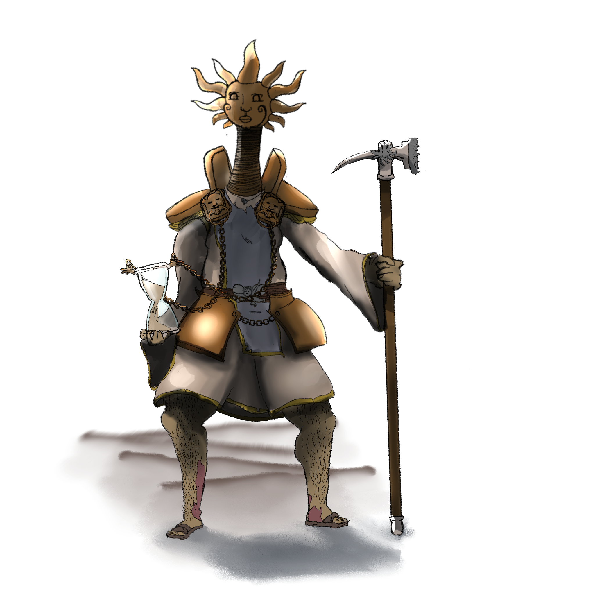
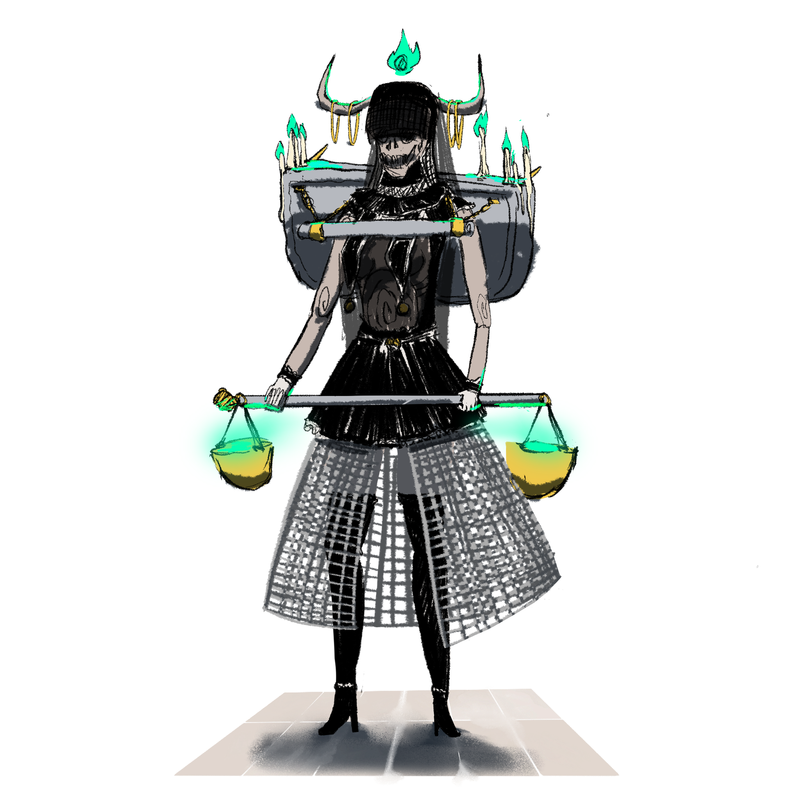
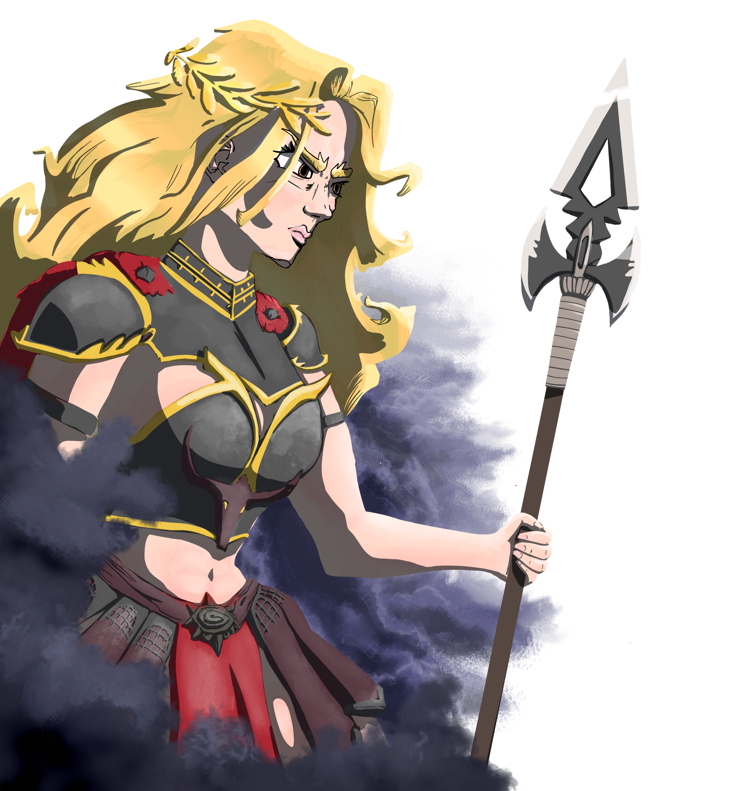
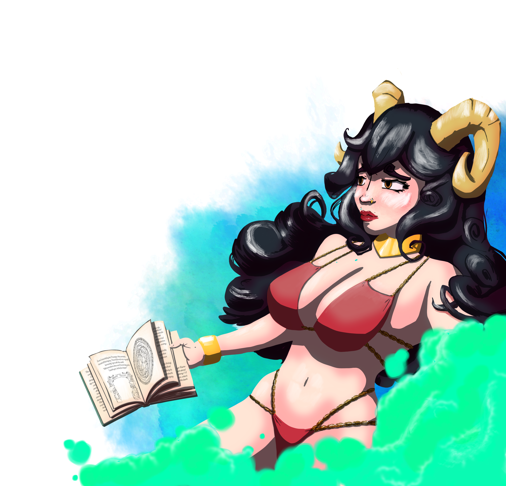
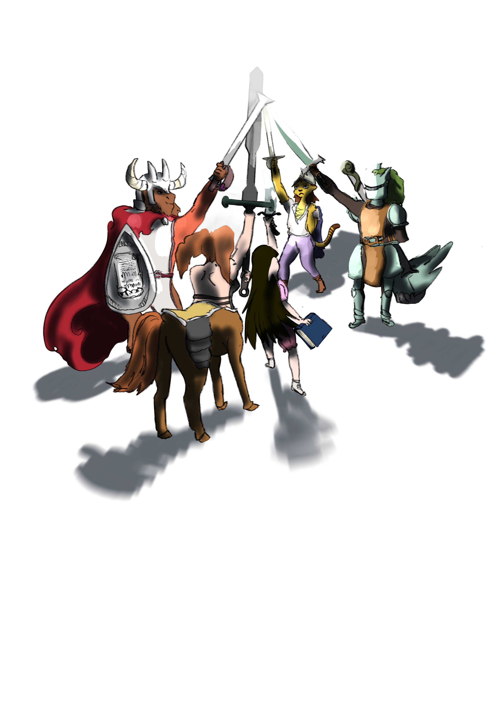
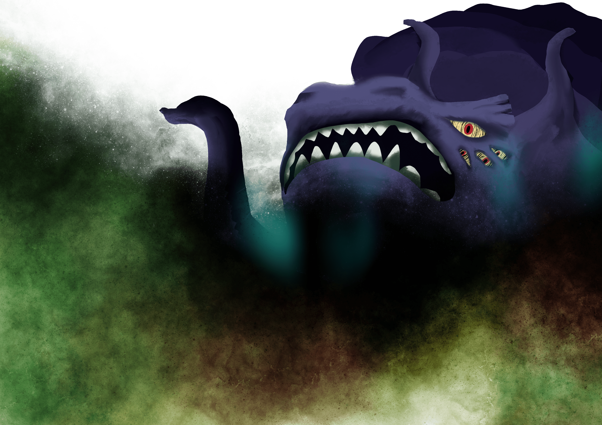
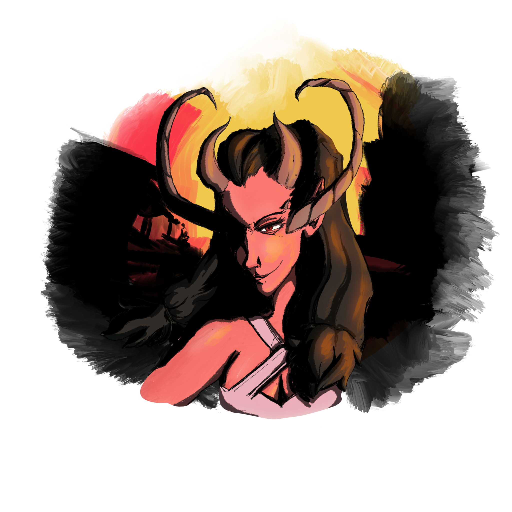
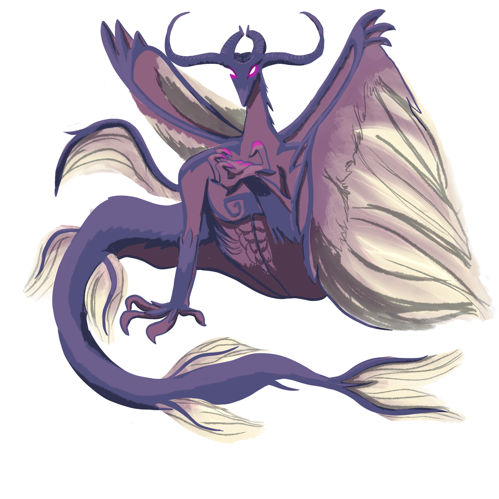
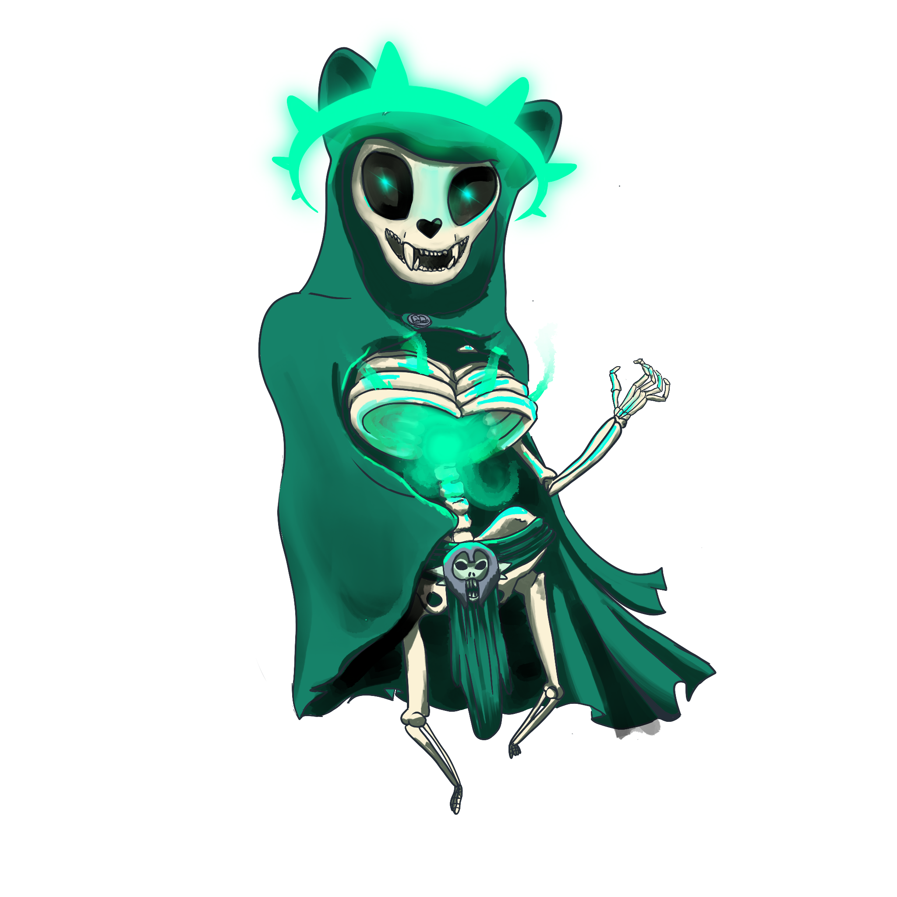

# The Gods of Galluvinchia

{ .wiki-portrait }

In Galluvinchia, the gods are not myths — they are neighbors.

They were once mortal heroes who rose from the great academies of Galluvinchia, slew the primordial titans, and ascended to divinity. Their humanity did not vanish with their apotheosis — it was *magnified*. They love fiercely, grieve deeply, and carry flaws as old as the world itself.

Faith in Galluvinchia is pragmatic. Much like the ancient Romans, citizens honor their deities while pursuing practical goals, invoking divine favor for battles, harvests, or commerce. Being a worshipper shapes who you are: followers of Aremedia value strength and the survival of the fittest; followers of Morphia prefer peace and the pursuit of knowledge.

The energy of the gods is fuelled by the actions of their believers — and by the might they achieved in their mortal lifetimes.

---

## The Pantheon

### Panos
*Guardian of Rhythm and Magic · God of Life and Order*

{ .wiki-emblem }

Panos is the eldest and perhaps the least publicly worshipped of the four major deities, yet his power underlies everything. He believes that rhythm and melody are the heartbeat of existence — that magic itself pulses to a cosmic song.

His followers are few but deeply devoted, preserving ancient dances and songs long forgotten by the world. In a curious twist, his role as god of magic and order means he is also responsible for keeping the natural order of existence intact.

Panos is known for his **capricious nature and faltering memory**, often losing items of sentimental or magical significance. Devoted worshippers embark on quests to recover these lost relics, believing each recovery restores part of his divine memory and power.

His most fervent zealots hide their faces with **masks resembling the sun**, believing Panos brings it every day to cast light and clarity upon mortals.

!!! quote "Suggested classes"
    Bard, cleric, monk, wizard

{ .wiki-full }

---

### Brenadette
*Keeper of the Life Cycle · Goddess of the Neverender*

{ .wiki-emblem }

Brenadette is tetchy and temperamental, and perhaps she has earned that reputation — her eternal duty as preserver of the Cycle of Life keeps her always awake, forever bound to the realm of the dead. She sacrificed sleep, and perhaps peace, so that the souls of the living could pass on and be reborn.

Her followers are some of the most fervent in Galluvinchia. Their practices are shrouded in mystery, governed by strict rules, and marked by the occasional blood sacrifice. They believe each act of devotion calms a raging storm or draws schools of fish closer to the shore.

The largest abbey dedicated to her stands in **Pharoes**, a city frequently battered by stormy weather. There, the locals revere her not only as keeper of the dead but also as the **Goddess of the Tempest**.

!!! warning "Dark faith"
    Many of her followers see Brenadette as justification for harsh deeds — gangs, violence, and darker ambitions shelter themselves beneath her name.

!!! quote "Suggested classes"
    Warlock, cleric, rogue, wizard

{ .wiki-full }

---

### Aremedia
*The Edge · Goddess of Impetus*

{ .wiki-emblem }

Aremedia is the first daughter of Panos and Brenadette, and she inherited all the energy of the world. She is the most frequently *seen* of all the gods — those who have laid eyes upon her describe electricity running through her long golden-like hair, a lean and tall figure, always armored, an olive branch crowning her presence.

She promotes striving, fighting, and working hard above all else. The harder people work, the more they receive her boon.

She rules over **An'Ramoda**, the most powerful military city in Galluvinchia, and commands the mightiest army on the continent. Her champion, **Armada**, has held the title of Colosseum Champion for more than ten years. Her achievements are celebrated yearly in the Colosseum with great gladiatorial games.

!!! quote "Suggested classes"
    Paladin, warrior, rogue, monk, barbarian, sorcerer, ranger

{ .wiki-full }

---

### Morphia
*The Thoughtful · Guardian of Dreams · Goddess of Love and Secrets*

{ .wiki-emblem }

Morphia is shy, timid, and often lost in her own dreams — which leaves her followers without her grace for stretches of time known as **Morphia's Slumber**. Yet her shrine at Doormi, beside its waterfalls, draws artists, doctors, and seekers of inner growth from across the land.

Her followers are peaceful but prone to overindulging in the pleasures of flesh, drugs, or drink. To keep balance, she knighted the **Order of the Dormant**, guardians who guide the faithful away from hedonism and toward stoicism and self-harmony.

She lends her power to the **Academy of Magic Waves and Dreams**, where craftspeople use the Loom of Dreams to weave magical garments.

Morphia also shared her divine power generously — elevating both **Leeve** and **Moroes** to godhood, though the relationships that followed were not without heartbreak.

!!! quote "Suggested classes"
    Paladin, wizard, sorcerer, druid, bard

{ .wiki-full }

---

### Moroes
*God of the Forge · Patron of the Lord of Carbohyrr*

{ .wiki-emblem }

Deep in the heart of the Lord of Carbohyrr, the clink of an anvil echoes through the caverns like the ominous bell of a cathedral. That sound is Moroes — and it has not stopped since the world was young.

His craftsmanship is said to be second to none. Legends tell that he crafted the very tools used to achieve divinity. But now he is secluded, guided by whispers crawling in his mind, perfecting his skill in solitude, creating legendary magic items that none else can match.

His followers — blacksmiths, sculptors, leatherworkers, jewelers — seek to create the finest work possible. Being the patron of Carbohyrr makes the city incredibly rich in crafts of every kind.

!!! note "A heart of iron"
    Moroes once loved Morphia deeply, gifting divine tools to her parents in exchange for her hand. When divinity was achieved, the wedding was cancelled. The heartbeat of his anvil, they say, is the only thing that stops the ache.

!!! quote "Suggested classes"
    Barbarian, wizard, warrior, cleric

{ .wiki-full }

---

### Leeve
*Goddess of Beauty and Nature*

{ .wiki-emblem }

Leeve is the youngest of the gods, elevated to divinity by Morphia herself. She is depicted in countless ways — those who do not know her might embrace her as the simple goddess of beauty, even indulging in their own vanity. But those who have been in her presence understand that beauty can be haunting, and that true beauty is found in nature and balance.

She is beloved by the people of the **Jewel of Evergrowth**, who live under the shadow of the First Tree she protects.

Although raised a paladin, Leeve is also deeply knowledgeable of the arcane, with a focus in nature magic — an intellectual shaped by hardship and friendship.

!!! quote "Suggested classes"
    Bard, wizard, cleric, druid

{ .wiki-full }

---

## The Connection Between the Gods

Brenadette and Panos met at one of Galluvinchia's great academies, and fell horribly in love. When they left their studies, Brenadette was carrying their first child: **Aremedia**. Not long after, **Morphia** arrived — and that is when both parents decided to leave behind a better world, especially for their family. They achieved divinity together and became the protectors and rulers of Galluvinchia.

**Moroes** helped them achieve that goal. Years later, Morphia began a relationship with him — but it did not last. The anvil was replaced by madness, and Morphia left his embrace.

From her deep sadness, the throne of love was left empty. But one of her paladins never lost faith. She chased Morphia even into her nightmares, and when the goddess returned, she was raised as **Leeve** — the goddess of beauty and nature.

---

## Other Powerful Beings

Not all powerful entities in Galluvinchia are among the six gods. Some are ancient, some are hidden, and some are best not spoken of too loudly.

### The Light
Many Galluvinchians pray to the Light rather than any specific god. Followers of the Light tend to be noble, naive, and optimistic, bound by oaths of clarity and honesty.

> *"The Light finds the way."*
> *"The Light doesn't shine in darkness."*

### The Will of the Wild
{ .wiki-portrait }

From times untold, the power of nature has been held by the Will of the Wild. Its veins are the roots of all the trees of Galluvinchia, and it is the forever warden of **Aurora Densasilva**, the eternal forest. Its ways may be eerie or twisted, but it will forever protect nature — one way or another.

### The Long-Lost Paladins
{ .wiki-portrait }

Wandering the ruins of Galluvinchia, the echoes of ancient paladins drift like angels serving justice. They seek to raise a new champion — one who will make freedom their shield and justice their sword.

### The Tarnished Star
{ .wiki-portrait }

In a distant land, abyss walkers — half shark, half person — lure souls from afar and invade realms with mighty power. Their empress, the Tarnished Star, holds the power of many worlds. She watches, waits, and looks for heralds who will allow her to visit and rule.

### The Nameless One
{ .wiki-portrait }

Swimming through the universe, the Nameless One wants the collapse of all existence — to consume all life, perhaps out of hatred, perhaps seeking peace. The creator of the void and the wielder of sadness, he travels relentlessly through space and time.

### The Lady of Horns
Deep below the Lord of Carbohyrr, a voice reaches upward. Of unknown origin and uncertain intentions, her whispers find the ears of Moroes — and those brave or foolish enough to bargain with her.

### The Long-Lost Dragons
{ .wiki-portrait }

Part of everyone's collective memory: there was a time when dragons inhabited Galluvinchia, or so they say. Slain by gods or fought by giants — do they still hold treasures in forgotten caves, or are they sleeping somewhere, waiting?

### Archlich Kogarashi
{ .wiki-portrait }

After the ancient Arcane War against Panos, the body of the master necromancer was never found. Other groups of necromancers have been surging ever since. Some search for his remains to end the undead threat; others seek the terrible knowledge he managed to grasp.
