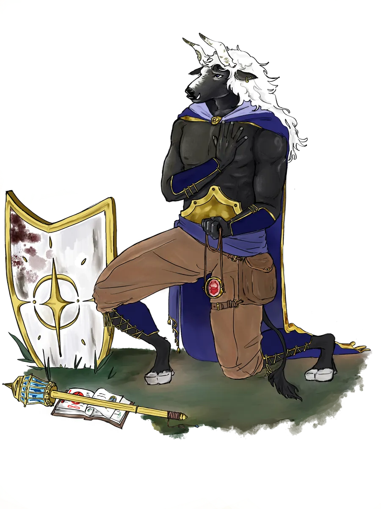

# The Gods of Galluvinchia

{ .wiki-portrait }

In Galluvinchia, the gods are not myths, they are neighbors.

They were once mortal heroes who rose from the great academies of Galluvinchia, slew the primordial titans, and ascended to divinity. Their humanity did not vanish with their apotheosis, it was *magnified*. They love fiercely, grieve deeply, and carry flaws as old as the world itself.

Faith in Galluvinchia is pragmatic. Much like the ancient Romans, citizens honor their deities while pursuing practical goals, invoking divine favor for battles, harvests, or commerce. Being a worshipper shapes who you are: followers of Aremedia value strength and the survival of the fittest; followers of Morphia prefer peace and the pursuit of knowledge.

The energy of the gods is fuelled by the actions of their believers, and by the might they achieved in their mortal lifetimes.

## The Pantheon

-   **[Panos](panos.md)**

    *Guardian of Rhythm and Magic*

    ---

    The eldest god. His cosmic song keeps magic and the natural order intact.

-   **[Brenadette](brenadette.md)**

    *Keeper of the Life Cycle*

    ---

    The sleepless goddess of the Neverender, bound forever to the realm of the dead.

-   **[Aremedia](aremedia.md)**

    *Goddess of Impetus*

    ---

    Daughter of Panos and Brenadette, ruler of An'Ramoda and its mighty army.

-   **[Morphia](morphia.md)**

    *Guardian of Dreams*

    ---

    Goddess of love and secrets, dreaming beside the waterfalls of Doormi.

-   **[Moroes](moroes.md)**

    *God of the Forge*

    ---

    The secluded smith of Carbohyrr, whose anvil has rung since the world was young.

-   **[Leeve](leeve.md)**

    *Goddess of Beauty and Nature*

    ---

    The youngest god, guardian of the First Tree at the Jewel of Evergrowth.

## The Bonds of the Pantheon

Brenadette and Panos met at one of Galluvinchia's great academies, and fell horribly in love. When they left their studies, Brenadette was carrying their first child: **Aremedia**. Not long after, **Morphia** arrived, and that is when both parents decided to leave behind a better world, especially for their family. They achieved divinity together and became the protectors and rulers of Galluvinchia.

**Moroes** helped them achieve that goal. Years later, Morphia began a relationship with him, but it did not last. The anvil was replaced by madness, and Morphia left his embrace.

From her deep sadness, the throne of love was left empty. But one of her paladins never lost faith. She chased Morphia even into her nightmares, and when the goddess returned, she was raised as **Leeve**, the goddess of beauty and nature.

## Beyond the Pantheon

Not all powerful entities in Galluvinchia are among the six gods. Some are ancient, some are hidden, and some are best not spoken of too loudly.

[Lesser Powers & Legends](lesser-powers/index.md){ .md-button }
