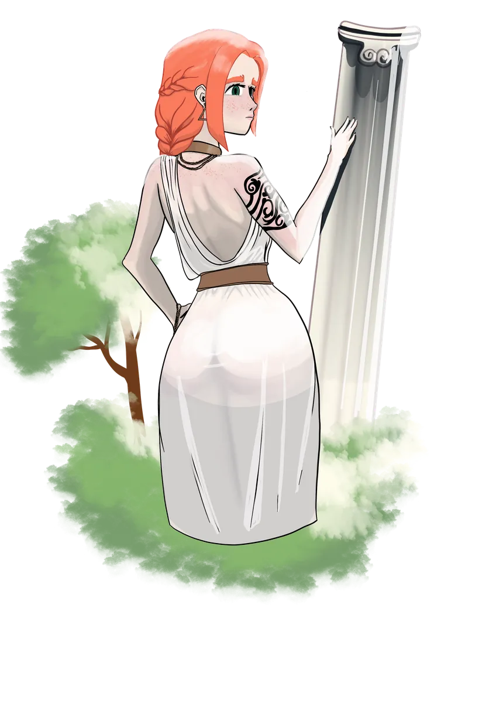

# Leeve

> *"Beauty is not the bloom. It is the balance that lets the bloom return."*

{ .wiki-infobox-img }

Leeve

Goddess of Beauty and Nature

{ .wiki-infobox-emblem }

<dl>
<dt>Domains</dt><dd>Beauty, Nature, Balance</dd>
<dt>Seat</dt><dd>The Jewel of Evergrowth</dd>
<dt>Raised by</dt><dd>Morphia</dd>
<dt>Guards</dt><dd>The First Tree</dd>
<dt>Worshipers</dt><dd>The people of the Jewel of Evergrowth</dd>
<dt>Classes</dt><dd>Bard, Wizard, Cleric, Druid</dd>
</dl>

Leeve is the youngest of the gods, elevated to divinity by [Morphia](morphia.md) herself. She is depicted in countless ways. Those who do not know her might embrace her as the simple goddess of beauty, even indulging in their own vanity. But those who have been in her presence understand that beauty can be haunting, and that true beauty is found in nature and balance.

## Description

Although raised a paladin, Leeve is also deeply knowledgeable of the arcane, with a focus in nature magic, an intellectual shaped by hardship and friendship.

## Worship

She is beloved by the people of the **[Jewel of Evergrowth](../regions/villages/index.md)**, who live under the shadow of the First Tree she protects.

## History

When Morphia withdrew into heartbreak, one of her paladins never lost faith and chased her even into her nightmares. When the goddess returned, that devoted paladin was raised as Leeve, the goddess of beauty and nature, filling the empty throne of love.
