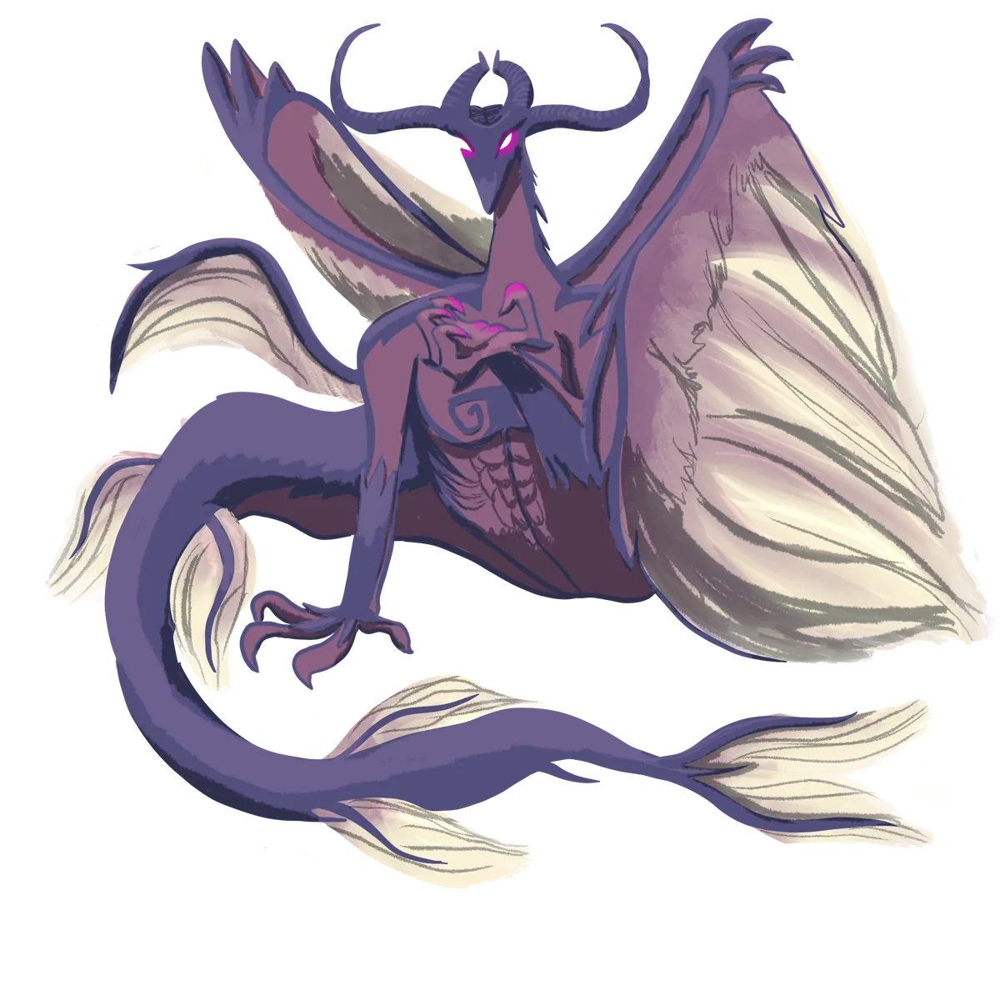

# Los Dragones Perdidos

{ .wiki-infobox-img }

Los Dragones Perdidos

Criaturas de la Era Antigua · Dormidos o Extintos

<dl>
<dt>Estado</dt><dd>Desconocido — último avistamiento en memoria viva: nunca</dd>
<dt>Era</dt><dd>Era de los Primordiales y antes</dd>
<dt>Individuo conocido</dt><dd>Krusninglömda, Dragón Anciano de las Venas de Mármol</dd>
</dl>

Parte de la fantasía colectiva de todos: hubo un tiempo en que los dragones habitaban Galluvinchia, o eso dicen. Cazados por los dioses o combatidos por los gigantes, ¿guardan tesoros en cuevas olvidadas, o duermen en algún lugar esperando?

## Krusninglömda

Un nombre surge en los textos más antiguos recuperados de la [Dama de Mármaros](../../regions/cities/lady-of-marmaros.md): **Krusninglömda**, un Dragón Anciano que se dice que tuvo su hogar en las venas de mármol bajo lo que hoy es la ciudad. Si fue cazado durante la fundación de Mármaros, o simplemente se retiró más profundo, ningún erudito lo ha confirmado.

## La Memoria Colectiva

Nadie vivo ha visto un dragón. Pero la palabra para dragón existe en todos los idiomas de Galluvinchia, incluidos algunos tan antiguos que ya no se hablan. Algo los nombró. Algo los recordó el tiempo suficiente para que la palabra sobreviviera.

