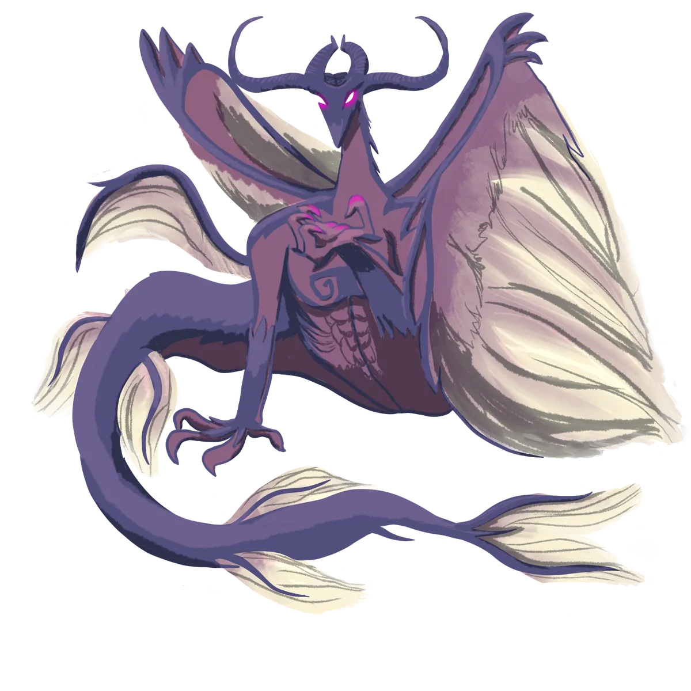

# Los Dragones Perdidos

{ .wiki-infobox-img }

Los Dragones Perdidos

Criaturas de la Era Antigua · Dormidos o Extintos

<dl>
<dt>Estado</dt><dd>Desconocido — último avistamiento en memoria viva: nunca</dd>
<dt>Era</dt><dd>Era de los Primordiales y antes</dd>
</dl>

Parte de la fantasía colectiva de todos: hubo un tiempo en que los dragones habitaban Galluvinchia, o eso dicen. Cazados por los dioses o combatidos por los gigantes, ¿guardan tesoros en cuevas olvidadas, o duermen en algún lugar esperando?

## La Memoria Colectiva

Nadie vivo ha visto un dragón. Pero la palabra para dragón existe en todos los rincones de Galluvinchia, incluso en textos y ciudades ya olvidadas. Algo los nombró. Algo los recordó el tiempo suficiente para que la palabra sobreviviera.

