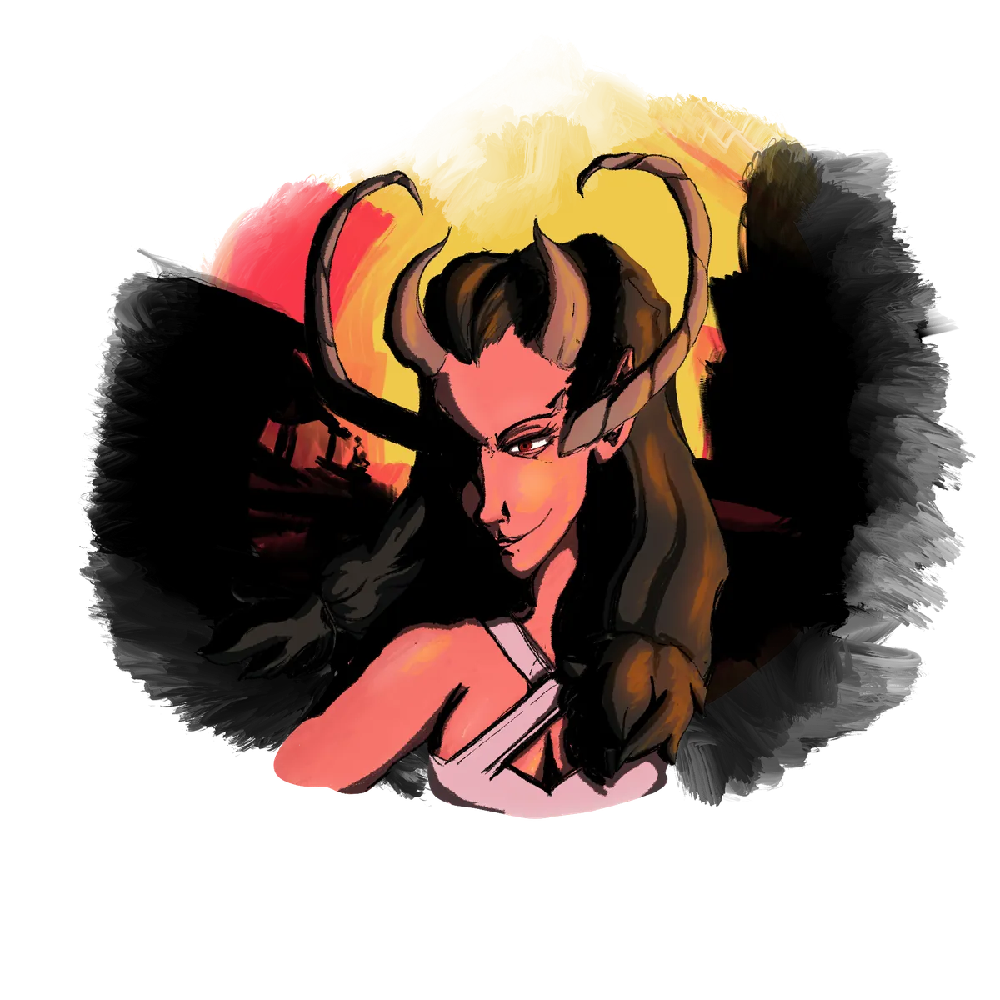

# The Nameless One

{ .wiki-infobox-img }

The Nameless One

Creator of the Void · Wielder of Sadness

<dl>
<dt>Nature</dt><dd>Cosmic force · Ancient beyond measure</dd>
<dt>Goal</dt><dd>Collapse of all existence</dd>
<dt>Domain</dt><dd>The void · Sadness</dd>
<dt>Status</dt><dd>Travelling through space and time</dd>
</dl>

Swimming through the universe, the Nameless One wants the collapse of all existence, to consume all life, perhaps out of hatred, perhaps seeking peace when all light has gone out. The creator of the void and the wielder of sadness, it travels relentlessly through space and time.

It has no followers. It does not seek them. It does not communicate. It simply moves, and where it has passed, things are quieter.

Whether it is aware of Galluvinchia, and whether it matters, is a question the scholars of the Academy prefer not to investigate too deeply.

