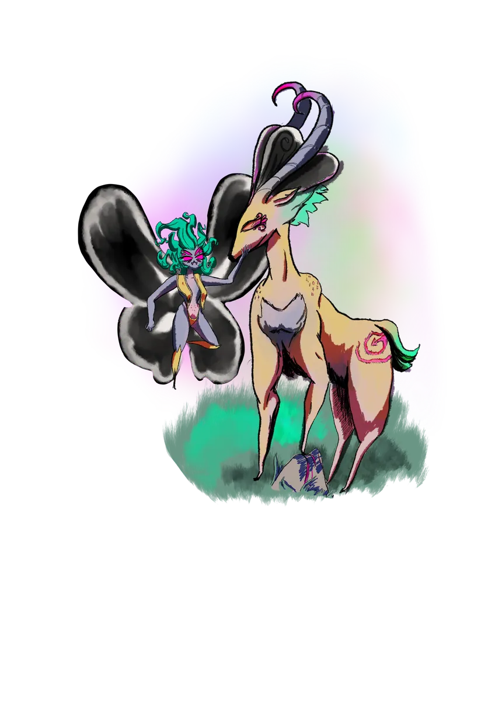

# La Voluntad de lo Salvaje

{ .wiki-infobox-img }

Voluntad de lo Salvaje

La Guardiana Eterna · Poder de la Naturaleza

<dl>
<dt>Naturaleza</dt><dd>Fuerza primordial · No una deidad</dd>
<dt>Dominio</dt><dd>Toda la naturaleza · Aurora Densasilva</dd>
<dt>Heraldo</dt><dd>La Reina de las Ramas</dd>
<dt>Actitud</dt><dd>Protectora · Caprichosa · Antigua</dd>
</dl>

Desde tiempos inmemoriales, el poder de la naturaleza ha sido custodiado por la Voluntad de lo Salvaje. Sus venas son las raíces de todos los árboles de Galluvinchia, y es la guardiana eterna de **[Aurora Densasilva](../../regions/points-of-interest/aurora-densasilva.md)**, el bosque perpetuo.

## La Reina de las Ramas

La Voluntad de lo Salvaje no habla con palabras que la mayoría de los mortales entiendan. En asuntos graves, actúa a través de su heraldo: la **Reina de las Ramas**, una figura que encarna el juicio del bosque.

## Conflicto con An'Ramoda

[An'Ramoda](../../regions/cities/anramoda.md) continúa expandiéndose hacia el este. La Voluntad de lo Salvaje arde de resentimiento. El pacto que [Aremedia](../aremedia.md) negoció hace mucho tiempo se mantiene más por la memoria que por la confianza.

