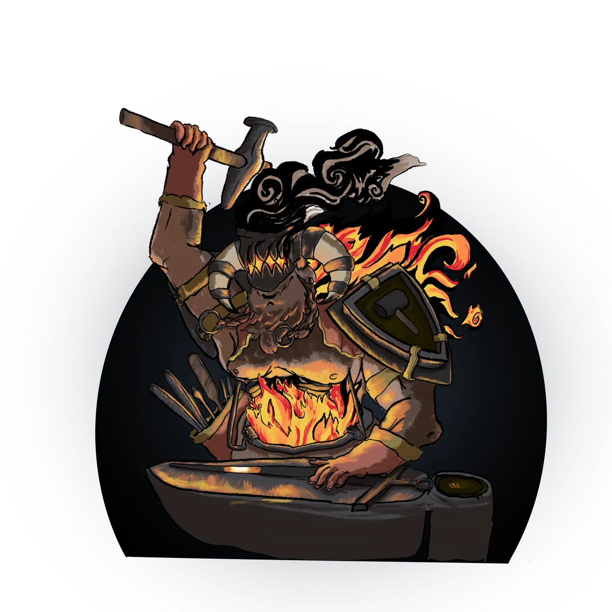

# Moroes

> *"Cada obra maestra le cuesta al herrero una parte de sí mismo. La mía compró un corazón que ya no puedo usar."*

{ .wiki-infobox-img }

Moroes

Dios de la Forja

{ .wiki-infobox-emblem }

<dl>
<dt>Títulos</dt><dd>Patrón del Señor de Carbohyrr</dd>
<dt>Dominios</dt><dd>Artesanía, la Forja, Maestría</dd>
<dt>Sede</dt><dd>El Señor de Carbohyrr</dd>
<dt>Elevado por</dt><dd>Morphia</dd>
<dt>Fieles</dt><dd>Herreros, escultores, joyeros, artesanos</dd>
<dt>Clases</dt><dd>Bárbaro, Mago, Guerrero, Clérigo</dd>
</dl>

En lo más profundo del Señor de Carbohyrr, el tintineo de un yunque resuena por sus cavernas como el sonido del ominoso campanario de una catedral. Ese sonido es Moroes, y no ha cesado desde que el mundo era joven.

## Descripción

Se dice que su maestría artesanal no tiene igual. Las leyendas cuentan que forjó las propias herramientas usadas para alcanzar la divinidad. Pero ahora está recluido, guiado por susurros que se arrastran en su mente, perfeccionando su habilidad en soledad, creando objetos mágicos legendarios que ningún otro puede igualar.

## Culto

Sus seguidores, herreros, escultores, trabajadores del cuero y joyeros, buscan crear la mejor obra posible. Ser el patrón de Carbohyrr convierte a la ciudad en un lugar muy rico en toda clase de oficios.

## Relaciones

!!! note "Un corazón de hierro"
    Moroes amó profundamente a [Morphia](morphia.md), entregando herramientas divinas a sus padres a cambio de su mano. Cuando se alcanzó la divinidad, la boda fue cancelada. El latido de su yunque, dicen, es lo único que puede detener el dolor de su corazón roto. Los susurros que ahora lo guían provienen, según se dice, de [la Dama de Astas](lesser-powers.md#la-dama-de-astas).

!!! quote "Clases sugeridas"
    Bárbaro, mago, guerrero, clérigo

{ .wiki-full }
