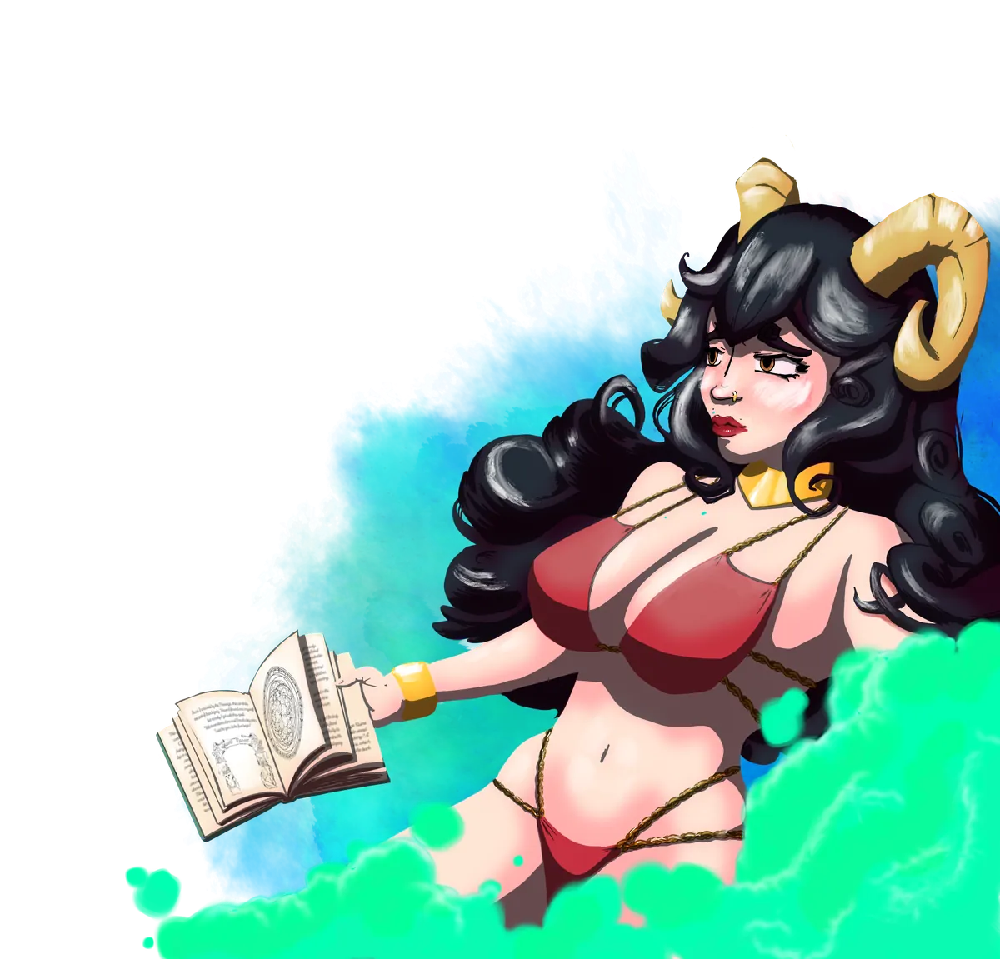

# Morphia

> *"Rest your eyes. The truest things are only ever seen with them closed."*

{ .wiki-infobox-img }

Morphia

The Thoughtful

{ .wiki-infobox-emblem }

<dl>
<dt>Titles</dt><dd>Guardian of Dreams, Goddess of Love and Secrets</dd>
<dt>Domains</dt><dd>Dreams, Love, Secrets</dd>
<dt>Seat</dt><dd>Doormi</dd>
<dt>Parents</dt><dd>Panos and Brenadette</dd>
<dt>Order</dt><dd>The Order of the Dormant</dd>
<dt>Worshipers</dt><dd>Artists, healers, seekers of growth</dd>
<dt>Classes</dt><dd>Paladin, Wizard, Sorcerer, Druid, Bard</dd>
</dl>

Morphia is shy, timid, and often lost in her own dreams, which leaves her followers without her grace for stretches of time known as **Morphia's Slumber**. Yet her shrine at Doormi, beside its waterfalls, draws artists, doctors, and seekers of inner growth from across the land.

## Worship

Her followers are peaceful but prone to overindulging in the pleasures of flesh, drugs, or drink. To keep balance, she knighted the **Order of the Dormant**, guardians who guide the faithful away from hedonism and toward stoicism and self-harmony.

She lends her power to the **Academy of Magic Waves and Dreams**, where craftspeople use the Loom of Dreams to weave magical garments.

## Relationships

Daughter of [Panos](panos.md) and [Brenadette](brenadette.md), Morphia shared her divine power generously, elevating both [Leeve](leeve.md) and [Moroes](moroes.md) to godhood, though the relationships that followed were not without heartbreak.

!!! quote "Suggested classes"
    Paladin, wizard, sorcerer, druid, bard

{ .wiki-full }
