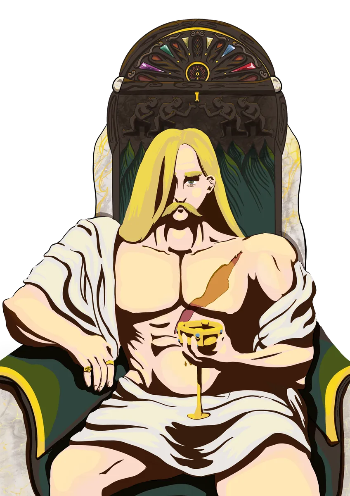

# Panos

> *"All things move to a rhythm. Magic is only the world remembering the song."*

{ .wiki-infobox-img }

Panos

Guardian of Rhythm and Magic

{ .wiki-infobox-emblem }

<dl>
<dt>Titles</dt><dd>God of Life and Order</dd>
<dt>Domains</dt><dd>Life, Order, Magic</dd>
<dt>Symbol</dt><dd>The Sun</dd>
<dt>Consort</dt><dd>Brenadette</dd>
<dt>Children</dt><dd>Aremedia, Morphia</dd>
<dt>Worshipers</dt><dd>Few, but deeply devoted</dd>
<dt>Classes</dt><dd>Bard, Cleric, Monk, Wizard</dd>
</dl>

Panos is the eldest and perhaps the least publicly worshipped of the four major deities, yet his power underlies everything. He believes that rhythm and melody are the heartbeat of existence, that magic itself pulses to a cosmic song.

## Description

His role as god of magic and order means he is also responsible for keeping the natural order of existence intact. Panos is known for his **capricious nature and faltering memory**, often losing items of sentimental or magical significance.

## Worship

His followers are few but deeply devoted, preserving ancient dances and songs long forgotten by the world. Devoted worshippers embark on quests to recover his lost relics, believing each recovery restores part of his divine memory and power.

His most fervent zealots hide their faces with **masks resembling the sun**, believing Panos brings it every day to cast light and clarity upon mortals.

## Relationships

Panos met [Brenadette](brenadette.md) at one of Galluvinchia's great academies, and the two fell deeply in love. Together they ascended to divinity and became the protectors of the land, parents to [Aremedia](aremedia.md) and [Morphia](morphia.md).

{ .wiki-full }
