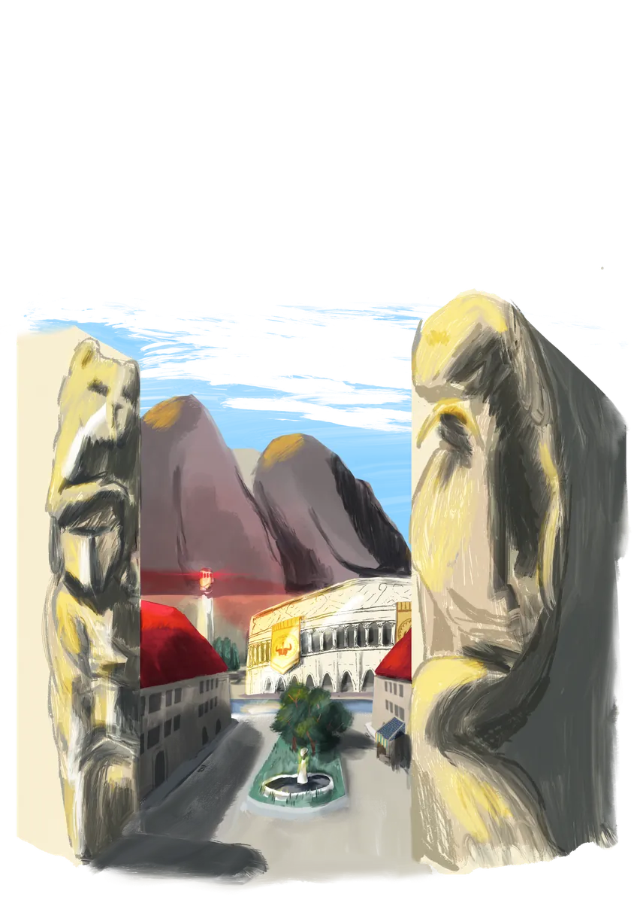
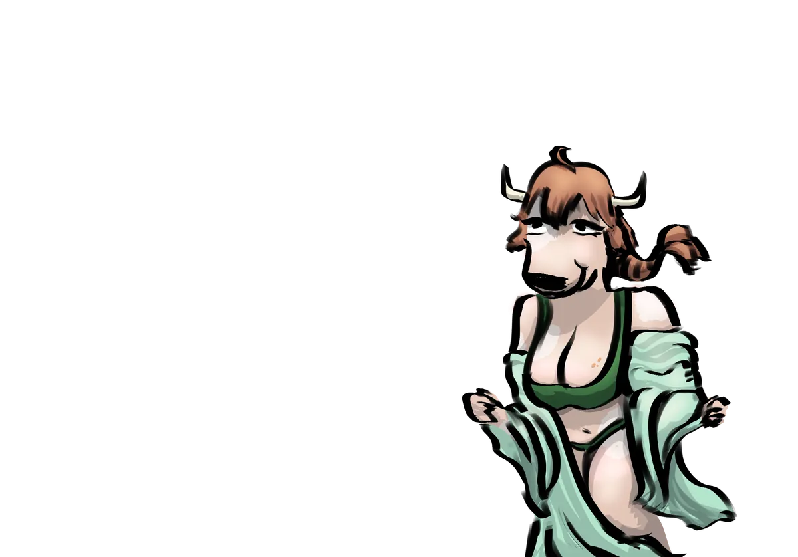
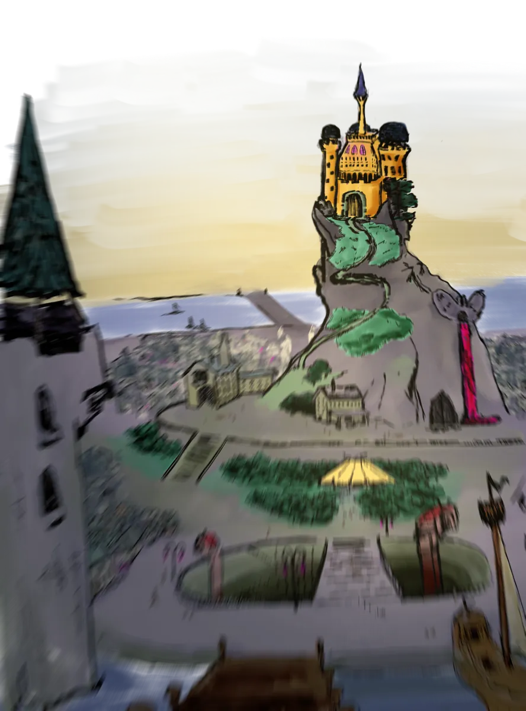

# Ciudades de Galluvinchia

Las ciudades de Galluvinchia son más que centros de comercio, son declaraciones. Cada muro, cada puerta, cada torre declara quién la construyó, quién la gobierna ahora y qué dioses se guardan en ella.

Tres grandes ciudades están protegidas por los Guardianes de Galluvinchia. Una cuarta se mantiene aparte, orgullosa e independiente.

---

## An'Ramoda

*La Ciudad Amurallada del Norte · Sede de Aremedia*

Construida como santuario por Salgu, el Rey de las Bestias, An'Ramoda se ha alzado como la mayor ciudad-fortaleza de Galluvinchia desde la Era de los Gigantes. Sus enormes murallas encierran a una próspera población cuyo amor por el combate y la búsqueda de un cuerpo fuerte no tiene igual.

El pueblo de An'Ramoda venera a Aremedia por encima de todo. Muchos ciudadanos sueñan con un día competir, y ganar, en el **Coliseo**, donde los combates de gladiadores y las pruebas de los juegos estacionales coronan campeones cada año. El campeón actual, un enorme minotauro negro conocido simplemente como **Armada**, lleva el título más de diez años. Nadie le ha visto jamás desenfundar su espada.

Dentro de las murallas se encuentran la **Torre de la Diosa**, la mina de oro y dos grandes barrios, uno para los favorecidos y otro para quienes se labraron un lugar con el trabajo duro.

### Estructura de Poder

| Autoridad | Descripción |
|-----------|-------------|
| **Aremedia** | Poder supremo por derecho divino. Su voluntad es ley |
| **Tres Cónsules** | Elegidos por la diosa: Lewis «El Recaudador» Pendeltag (sabiduría), Zack «La Espada» Armada (valor), Martin «La Moneda» Goldberg (comercio) |
| **Seis Senadores** | Elegidos por los cónsules con la aprobación de Aremedia |

### El Ejército
Compuesto por más de 7.000 combatientes entrenados, el ejército an'ramodano no tiene rival. Una sección dedicada llamada los **Guardianes de Galluvinchia** patrulla las rutas comerciales por todo el continente, protegiendo las caravanas de mercaderes y manteniendo el orden en las ciudades.

### Poblaciones Cercanas
Las aldeas alrededor de An'Ramoda son leales a la ciudad y envían a sus mejores luchadores a ganarse el favor de Aremedia:

- **Picarosh**, el pueblo de la gastronomía
- **Craikov**, el puerto de An'Ramoda
- **San Erensburgo**, famoso por sus jardines subterráneos
- **Tanishia**, pueblo de viñedos, productores de los mejores vinos de Galluvinchia
- **Gretscznievlycov**, rodeado de colinas doradas y molinos de viento

{ .wiki-full }

!!! tip "Rumor"
 Los luchadores derrotados en el Coliseo aún están por aparecer. Sus familias aceptan que, pase lo que pase, es gloria o muerte, pero no todos están tan seguros.

---

## La Dama de Mármaros

*La Ciudad de Mármol · Hogar de la Academia de Magias Maravillosas*

La Dama de Mármaros fue esculpida desde una gran montaña de mármol, nacida del impacto del colossal asteroide que puso fin a la Era de los Primordiales. La ciudad es inmensamente orgullosa de sus magos y eruditos, albergando la institución arcana más prestigiosa de Galluvinchia: la **Academia de Magias Maravillosas**, presidida por la **Magistrada Mónica Mars**.

Los marmarienses son conocidos por su vanidad y su orgullo en las apariencias. La ciudad está llena de peluquerías, salones de masajes y un hospital que trabaja en las inseguridades de su gente. También es el hogar de la principal empresa de noticias de la tierra: el **Heraldo de Rick**, que se esfuerza por la claridad y la objetividad.

### Estructura de Poder

El poder en la Dama de Mármaros es complejo y a veces contradictorio:

| Autoridad | Descripción |
|-----------|-------------|
| **Rey Fernando Oldreekia** | Real por sangre, dueño de la Guardia Real, las tierras y las minas de mármol |
| **La Academia de Magias Maravillosas** | Dirigida por la Magistrada Mónica Mars; una fuerza creciente a través de sus numerosos productos de marca |
| **El Gremio** | Gremio de mercaderes que controla los registros comerciales y el comercio en todo Galluvinchia |
| **El Puño** | Una red en la sombra cuyo alcance se extiende desde la realeza hasta el ejército, y cuyo líder no conoce nadie |

### La Academia de Magias Maravillosas
{ .wiki-portrait }

La beca estudiantil más exclusiva de Galluvinchia. Los aprendices de mago formados aquí se convierten en magos multidisciplinares, estudiando todas las escuelas de magia bajo la guía de algunas de las mentes más brillantes del mundo. La influencia de la Academia es visible por todo el continente a través de sus pociones, lociones y productos mágicos de marca.

!!! tip "Rumor"
 Los mineros de Mármaros han ido enfermando progresivamente. Desde las profundidades de las venas de mármol se escuchan susurros de algo más oscuro. ¿Es el polvo de mármol ahora usado en drogas y cosméticos? ¿O algo completamente distinto?

---

## El Señor de Carbohyrr

*La Ciudad Negra · Fortaleza Montañosa de la Forja*

Escondida en el interior de una montaña, el Señor de Carbohyrr es una ciudad de largas chimeneas, el hedor de las brasas y una artesanía sin igual. Famosa por sus baños termales y sus minas profundas, es el corazón industrial de Galluvinchia, el lugar donde se forjan las mejores armas y armaduras. Los carbohyrrianos son serios y de trato frío para tener un hogar tan cálido.

Toda persona que viva o visite el Señor está obligada a llevar un **pase de cobre** fabricado por los Magos de Batalla, usado para llevar el control de las contribuciones fiscales y otorgar acceso a los ascensores centrales de la ciudad.

El espacio dentro de la montaña es precioso. Los ciudadanos han aprendido a improvisar: jardines verticales, baños públicos comunes y la **Institución del Desarrollo Adecuado**, a la que los niños son enviados a los seis años y se les orienta hacia una carrera profesional a los nueve.

### Estructura de Poder

| Autoridad | Descripción |
|-----------|-------------|
| **El Duque** | Elegido por votación de los contribuyentes fiscales cada dos años |
| **Los Magos de Batalla** | Policía mágica entrenada que mantiene el orden y lleva las cuentas fiscales |

### Las Profundidades
{ .wiki-portrait }

La economía de Carbohyrr descansa casi completamente en sus forjas. An'Ramoda es el principal comprador de armas y armadura, pero incluso Lorda Gorda ha comenzado a adquirir productos de la montaña. Con la economía bajo presión, los mineros y herreros son el único trabajo fiable disponible, y las tensiones entre la clase trabajadora y la estructura gobernante comienzan a hervir.

!!! tip "Rumor"
 Los precios en el Señor no dejan de subir, y las oportunidades para los jóvenes carbohyrrianos se reducen a la mina y la forja. Quienes soñaban con el arte o el comercio trabajan ahora bajo la dura sombra del control económico de An'Ramoda. Algo tiene que ceder.

---

## Lorda Gorda

*La Isla-Fortaleza · Bastión de los Felicios*

{ .wiki-portrait }

Lejos de las zonas de patrulla de los Guardianes de Galluvinchia se encuentra Lorda Gorda, la ciudad más orgullosa del este. Habitada principalmente por trabajadores felicios, rechaza las bendiciones de los dioses y reza en cambio a la Luz.

La ciudad se ilumina de noche con **cristales rosas** extraídos de las profundidades. Estos cristales son la piedra angular de la cultura de Lorda Gorda, alimentan sus calles, propulsan sus barcos y guardan algo mucho más personal en su interior.

Lorda Gorda está conectada al continente por el Whisk de Lumin y recibe trigo y verduras de las tierras verdes a cambio de defensa contra los ataques de necrófagos y piratas del este.

### Estructura de Poder

Lorda Gorda es gobernada por una asamblea donde los principales grupos tienen votos. Se necesitan 5 puntos para aprobar cualquier ley o decisión:

| Grupo | Votos |
|-------|-------|
| **El Rey sin Melena** | 4 votos (incluidos los votos anteriores de la Guardia Real) |
| **Orden y Defensa** | 1 voto |
| **Los Constructores de Barcos** | 1 voto |
| **Unión de los Pescadores** | 1 voto |
| **Mineros de Cristal** | 1 voto |
| **Voto Popular** | 2 votos |

### Los Cristales Rosas
Los cristales que iluminan la ciudad están formados por la energía persistente de las almas de la gente de Lorda Gorda. A los dieciocho años, cada ciudadano salta a la Fuente del Resurgimiento, un ritual que, al morir, vinculará la energía de su alma a estos cristales rosas extraídos de las profundidades. Los cristales brillan con esta energía antes de que las almas continúen hacia el Resurgimiento.

### Los Constructores de Barcos
Los constructores de barcos de Lorda Gorda son legendarios. Viviendo rodeados de brutales olas y monstruos marinos, su tecnología ha evolucionado a niveles que dejan sin palabras a los capitanes de puerto del continente.

### La Biblioteca de la Iluminación Eterna
Cerca del castillo del Rey sin Melena se encuentra una biblioteca que alberga cientos de textos, algunos de más de 500 años y escritos en idiomas desconocidos. Una notable sección está dedicada a la investigación médica.
