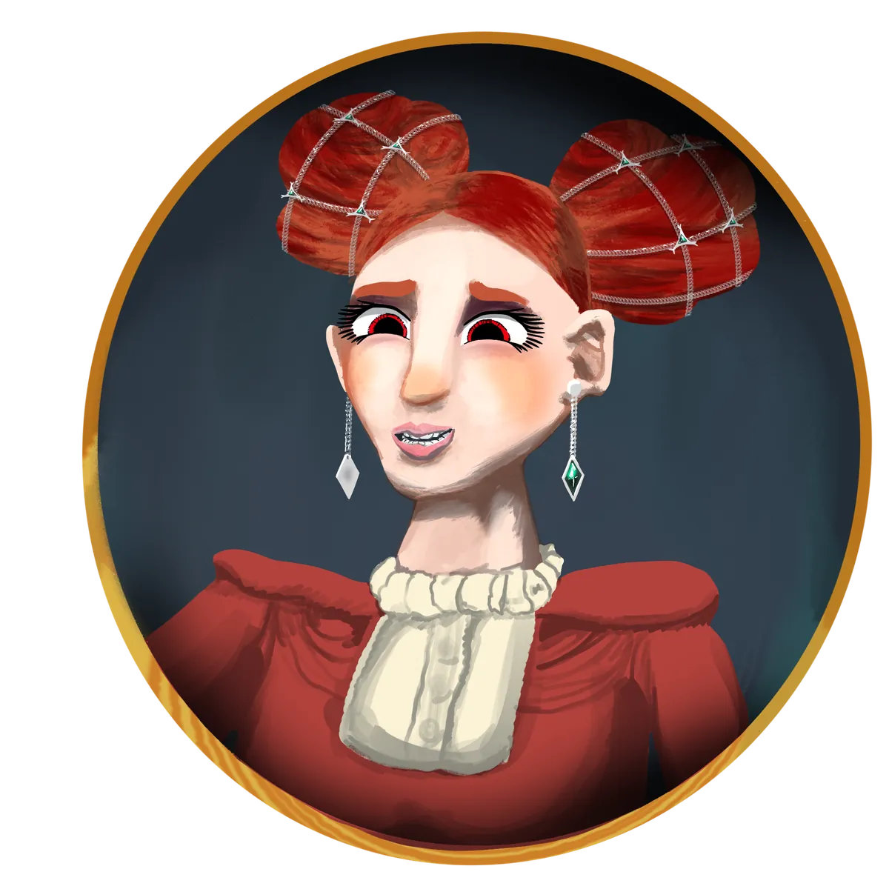

# The Lady of Marmaros

{ .wiki-infobox-img }

Lady of Marmaros

The Marble City · Home of the Academy of Magic Wonders

<dl>
<dt>Ruler</dt><dd>King Fernando Oldreekia · Academy · Guild</dd>
<dt>Location</dt><dd>Island, Central Galluvinchia</dd>
<dt>Known for</dt><dd>Magic, scholarship, vanity</dd>
<dt>Patron</dt><dd>None official</dd>
</dl>

The Lady of Marmaros was sculpted from a great marble mountain, born from the impact of the asteroid that ended the Age of Primordials. The city is immensely proud of its mages and scholars, housing the most prestigious arcane institution in Galluvinchia: the **Academy of Magic Wonders**, presided over by **[Magister Monica Mars](../../characters/monica-mars.md)**.

Marmarians are known for their vanity and pride in appearances. The city is full of hair salons, massage parlors, and a hospital catering to its citizens' insecurities. It is also home to **Old Rick's Herald**, Galluvinchia's foremost news company.

## Power Structure

| Authority | Description |
|-----------|-------------|
| **[King Fernando Oldreekia](../../characters/fernando-oldreekia.md)** | Royal by blood, owner of the Royal Guards, land, and marble mines |
| **The Academy of Magic Wonders** | Led by [Magister Monica Mars](../../characters/monica-mars.md); surging influence through branded products |
| **The Guild** | Merchant Guild controlling trade registries throughout Galluvinchia |
| **The Fist** | A shadow network whose leader is known to no one |

{ .wiki-full }

!!! tip "Rumour"
    The miners of Marmaros have been growing progressively sick. From deep within the marble veins, whispers of something darker have been heard.

