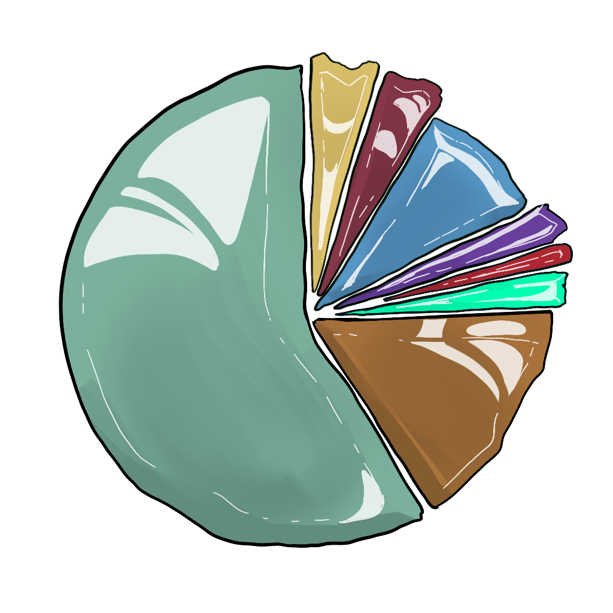

# The World of Galluvinchia

Galluvinchia is a land of impossible contrasts, ancient ruins beside thriving cities, deserts that were once jungles, forests where the trees remember the First Age.

The geography of this world did not form by chance. Giants shaped it. Primordial beasts tore it. And the gods, once mortal heroes themselves, bled to make it livable.

---

## Geography at a Glance

The known lands of Galluvinchia stretch from the cold mountains of the frozen North to the arid Breath of Sand in the East. Most of the population lives in the temperate West, enjoying a **Mediterranean climate**, rainy in autumn, windy in spring, long summers, and calm winters.

Travelling the roads between cities, one passes through forests and farmland in most of the West, with mountainous terrain rising in the East and a snowy expanse in the North.

Three great cities anchor civilization:

- **An'Ramoda**, the walled northern city, seat of the most powerful army in Galluvinchia
- **The Lady of Marmaros**, the marble island city of mages and scholars
- **The Lord of Carbohyrr**, the mountain fortress of smiths and miners

And to the East, largely independent:

- **Lorda Gorda**, the felinfolk fortress island, lit by pink crystal light

---

## Current Affairs (Year 1802)

### The Pax Aremedia
The land broadly enjoys a period of peace enforced by Aremedia's armies and the **Keepers of Galluvinchia**, a dedicated force that patrols trade routes and protects merchant caravans across the continent.

### The Third Wars of the Skeleton
Three years ago, the Third Wars of the Skeleton ended with a successful incursion by An'Ramoda's forces into Kogarashi's territory at **Ancho Groncho**. But the necromancer's body was never found, and the undead continue to stir.

### The Giants' Skirmishes
To the north at **Ice Peak**, the house of the giants lies hidden behind hungry winters and sharp mountains. Legions of warriors have been lost in recent years trying to set limits to the giants' violent raids on settlements to the south.

### The Furnace's Song
At the Lord of Carbohyrr, the furnaces burn warmer than ever, pushing the economy into survival mode. Almost every commerce now revolves around sustaining the forge, the main export of weapons and armor, shipped primarily to An'Ramoda.

### Woodkeeping Ambitions
An'Ramoda continues to expand eastward into the forest. The forest, burning with resentment, seeks allies against the lumberjack forces pressing from both sides.

### The Forsaken Undead
The undead armies have been raging since the Arcane War ended. An'Ramoda has been directing assaults on Ancho Groncho, with many successful incursions. At the other side of Galluvinchia, the Whisk of Lumin keeps a watch system of towers to notify when ghouls surge from the desert.

---

## Society

{ .wiki-chart }

The people of Galluvinchia are pragmatic and diverse. Society is not divided by gender, anyone can become whatever they will, and men and women are equally capable. However:

- Public healthcare is not universal
- Justice is inconsistent and often unfair
- Democracy is not the standard form of government
- Slavery is seen as deeply wrong

Most citizens are farmers. Education is offered in some temples, primarily those of Brenadette and Panos, covering reading, basic mathematics, and some arts. Crafts and higher education require apprenticeships or significant wealth.

### Natural Rights
All Galluvinchians share a belief in three universal natural rights, considered to predate even the gods:

| Right | Meaning |
|-------|---------|
| **Life** | The right to live and protect oneself |
| **Liberty** | Freedom from arbitrary restraint |
| **Property** | The right to own and enjoy possessions |

### The Cycle of Life and Death
When Galluvinchians die, their free soul lingers briefly near their body to resolve last wishes. After a proper burial, or when all resentment fades, the soul travels to the **Neverender** to become part of the **Renewal**, eventually returning to the living in a new body.

---

## The Ripple

All magic in Galluvinchia originates from a single fundamental force: **the Ripple**, a current that washes all living beings with magic.

- **Wizards** learn to sense and harness its flow
- **Sorcerers** feel its rhythm innately, by heritage or event
- **Warlocks** receive it funneled through a Patron
- **Bards** summon its rhythm through chants and songs
- **Druids and Rangers** synchronize with the Ripple of the Will of the Wild
- **Clerics** draw their power from the gods or the Light itself
- **Paladins** are drawn to the Ripple by the strength of their oath

!!! info "The Source of the Ripple"
 The source of the Ripple remains a mystery. Yet those highly attuned to its presence sometimes perceive a distant sound, the voice of an anvil, and the clink of a hammer, forging this stream of magic.

---

## Calendar

The Galluvinchia calendar runs on **7-day weeks**, with 4 weeks per month and 12 months per year, 336 days in total. The seventh day is the **Light Day**, celebrated with family.

Months are numbered from the First to the Eleventh, with the last month called simply **the Last**.

### Major Festivities

| Festivity | Date | Description |
|-----------|------|-------------|
| **Night of the Neverender** | 2nd of the 2nd | On the coldest day of winter, people send wooden boats with candles and messages into the waters in memory of those who have passed |
| **Day of the Parents** | 20th of the 7th | Children write letters to their parents, who hang them on their walls |
| **Day of the Dragons** | 1st of the 11th | Children fly dragon-shaped kites together |
| **Day of the Original Gift** | 22nd of the Last | Parents give gifts to their children to celebrate the gift the gods bestowed upon all |

---

## Coinage

The standard currency of Galluvinchia is the **dinarii** (singular: dinar), produced by the Bank of An'Ramoda. The exchange rate is **100 dinarii = 1 aureo**.

| Item | Approximate Cost |
|------|-----------------|
| Common meal | 1–50 dinarii |
| Tavern stay | 10–50 dinarii |
| Riding horse | 75 aureos |
| Longsword | 10 aureos |
| Plate armor | 1, 000 aureos |
| Healing potion | 50 aureos |

The Keepers of Galluvinchia protect not only merchant caravans but also operate a banking system, merchants can deposit gold in one stronghold and withdraw from another, much as the Templars did in the old world.

---

## Navigate

- [Cities](cities/index.md)
- [Villages](villages/index.md)
- [Points of Interest](points-of-interest/index.md)
