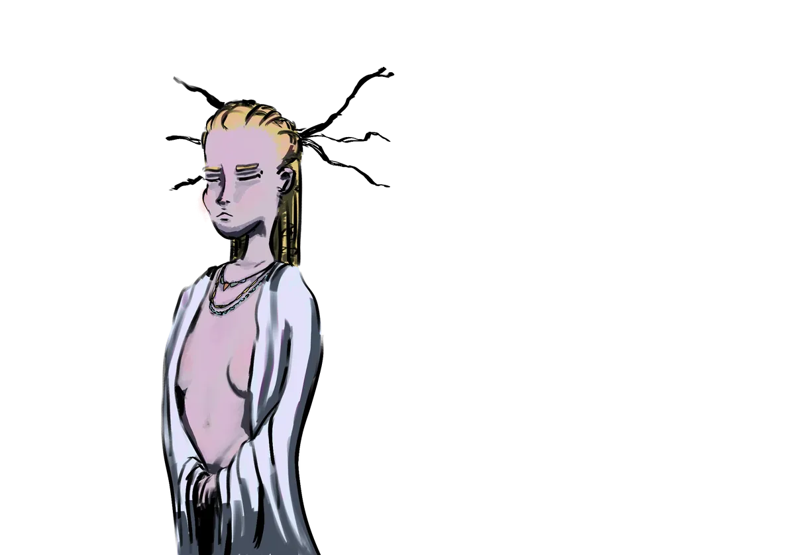

# Aurora Densasilva

{ .wiki-infobox-img }

Aurora Densasilva

The Eternal Forest · The Twisted Wood

<dl>
<dt>Location</dt><dd>Heart of Galluvinchia</dd>
<dt>Ruler</dt><dd>The Queen of Branches · Will of the Wild</dd>
<dt>Access</dt><dd>Friends of the forest only</dd>
<dt>Danger</dt><dd>High for the unwelcome</dd>
</dl>

At the heart of Galluvinchia spreads Aurora Densasilva, the perpetual, impenetrable, ancient forest. It is alive in ways that no other forest is: its roots remember the First Age, and its branches carry grudges.

Within its twisted roots lives a civilization, not numerous, but rich in spirituality, protected by the **Will of the Wild**. Only friends of the forest are welcome here. Treasure hunters and explorers are turned away, lost, or never seen again.

!!! quote ""
    *"Its hunger makes it grow without end. Political agreements, promises, are rarely kept by its inhabitants."*

The forest is directed, in grave matters, by the **Queen of Branches**, a herald of the Will of the Wild itself.

An'Ramoda continues to expand eastward into the forest, and the forest burns with resentment.

