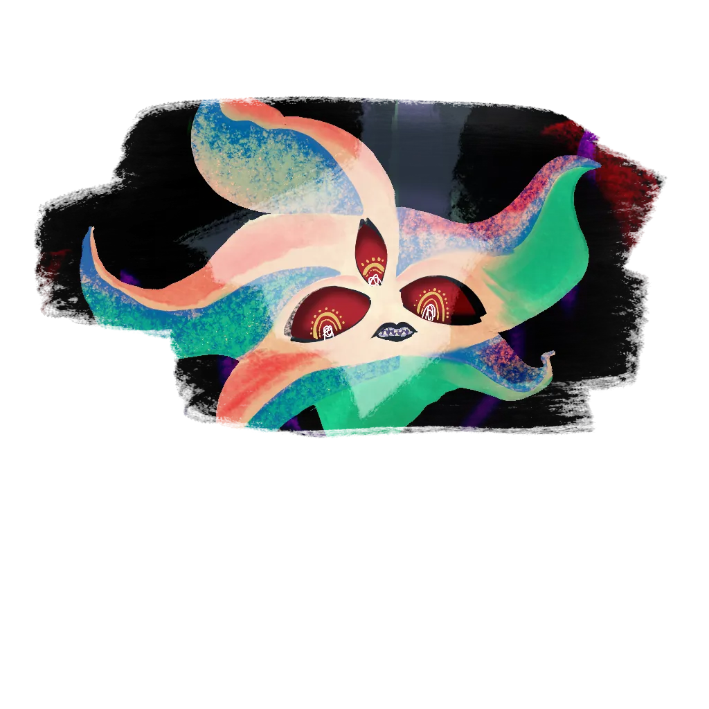

# Puntos de Interés

Galluvinchia es vasta, y gran parte de ella permanece inexplorada. El este más allá del Señor de Carbohyrr está lleno de lugares por descubrir, el calor del desierto mantiene a los exploradores lejos, y el mar está lleno de criaturas que desalientan la navegación. Pero estos lugares conocidos han atraído a aventureros, eruditos e insensatos durante generaciones.

---

## Puntahelada

*Morada de los Gigantes · El Norte Helado*

En los confines más septentrionales de Galluvinchia, tras hambrientos inviernos y montañas afiladas como cuchillas, se encuentra Puntahelada, la fortaleza oculta de los gigantes. Incluso en la actual era de la *Pax Aremedia*, guerreros armados se pierden regularmente intentando llegar a este lugar y poner límite a las incursiones de los gigantes.

Hace mucho tiempo, los gigantes vivían en armonía en An'Ramoda. Luego una colérica locura comenzó a apoderarse de algunos de ellos, una rabia incontrolable que amenazaba la ciudad. Aremedia los desterró a todos al extremo norte, donde su influencia mengua.

*No lo han olvidado.*

---

## Aurora Densasilva

*El Bosque Eterno · El Bosque Retorcido*

{ .wiki-portrait }

En el corazón de Galluvinchia se extiende Aurora Densasilva, el bosque perpetuo, impenetrable, antiguo. Se dice que está vivo de maneras que ningún otro bosque lo está: sus raíces recuerdan la Primera Era y sus ramas guardan rencores.

En el interior de sus retorcidas raíces vive una civilización, no muy numerosa, pero rica en espiritualidad, protegida por la Voluntad de lo Salvaje. Solo los amigos del bosque son bienvenidos aquí. Los cazadores de tesoros y exploradores son rechazados, perdidos o jamás vistos de nuevo.

!!! quote ""
 *"Su hambre lo hace crecer sin fin. Los acuerdos políticos, las promesas, raramente son cumplidos por sus habitantes."*
 Dicho popular

El bosque está dirigido, en asuntos graves, por la **Reina de las Ramas**, un heraldo de la propia Voluntad de lo Salvaje.

---

## El Suspiro de Arena

*El Desierto del Este · El Último Oasis*

Al este del Señor de Carbohyrr, donde antaño se alzaba una jungla, se extiende ahora una interminable extensión árida: el Suspiro de Arena. Escondida en su interior hay una pequeña comunidad que vive en los últimos vestigios verdes, el último oasis, mantenido vivo por la **familia Horangi**, la última de un linaje felicio antiguo con conexiones profundas y misteriosas con la tierra.

Ruinas antiguas salpican el desierto. Lo que fueron en su día, ciudades, templos, academias, está en su mayor parte olvidado.

---

## Ourobolis

*El Mar Púrpura · Donde Cayó la Serpiente*

{ .wiki-portrait }

Lejos al noreste, el mar alrededor de esta isla se volvió púrpura cuando la serpiente primordial **Aolosh** fue vencida por los dioses en ascenso. La isla es el hogar de una tribu que aún venera a la serpiente caída, sus rituales son los más extremos de Galluvinchia, alimentados por la sangre corrompida de su patrón caído.

Brenadette observa este lugar con especial preocupación.

---

## La Bruma

*Origen de los Elfos · El Extremo Oriente*

En el borde oriental del mundo conocido, una bruma permanente se extiende. De aquí vinieron los elfos, o más bien, aquí se retiraron. Forman parte de la leyenda ahora, raramente vistos en el resto de Galluvinchia. La bruma se describe como un lugar de maravilla y éxtasis, de sombras y magia. Desde fuera solo se puede escuchar la resonancia de algo antiguo y poderoso.

> *"Los elfos estuvieron aquí antes de que ninguno de nosotros fuera siquiera un pensamiento."*
>, Juan Passage

---

## Ozan Tizuki

*La Ruina Élfica · Antaño el Centro de la Civilización*

Más al este, pasada la bruma, se encuentran las ruinas de lo que fue en su día la mayor civilización élfica que Galluvinchia había visto jamás. Lo que le ocurrió es un misterio que incluso los propios elfos ya no recuerdan.

---

## Las Ruinas de Everaisla

*Estructura Olvidada del Sur*

Entre Lakobordo y Lorda Gorda yacen las ruinas de una estructura sobre la que nadie se pone de acuerdo: algunos dicen que fue una iglesia, otros una catedral, un ayuntamiento o una academia. La verdad se ha perdido en el tiempo. Lo que queda es piedra vieja y preguntas sin respuesta.

---

## Las Minas de Plata (Joya Siemprecreciente)

*Recientemente Abiertas · Fuente de la Nueva Prosperidad de la Isla*

La mina de plata de la Joya Siemprecreciente se abrió recientemente, y ha transformado la isla, trayendo nuevas familias, nuevos mercaderes y nueva prosperidad. La mina crece, y la isla crece con ella.

Pero las paredes de la mina no están del todo en silencio.

---

## Las Academias

Tres academias han dado forma al paisaje mágico de Galluvinchia, una en todo su esplendor, una que prospera con humildad y una perdida ya en el tiempo.

### Academia de Magias Maravillosas
Situada en la Dama de Mármaros, la beca estudiantil más exclusiva de Galluvinchia. Presidida por la Magistrada Mónica Mars, forma a magos multidisciplinares considerados entre las mentes más brillantes del mundo.

### Academia de las Ondas Étereas y los Sueños
En los acantilados de Doormi, esta academia es más humilde en enfoque pero más generosa en acceso, dirigida por Merrion Meyer, ofrece el primer año de estudio gratuito a los estudiantes más brillantes. Su especialidad reside en el Telar de los Sueños y la confección de prendas mágicas.

### Academia de Viajes Infinitos *(Ruinas)*
En el Golfo de Febris se encuentran las ruinas de una academia en su día grandiosa, hace tiempo olvidada y usada ocasionalmente como guarida. Se dice que los recuerdos de antiguos conjuros persisten en sus piedras. Lo que fuera que se estudiara aquí, gran parte se ha perdido.
