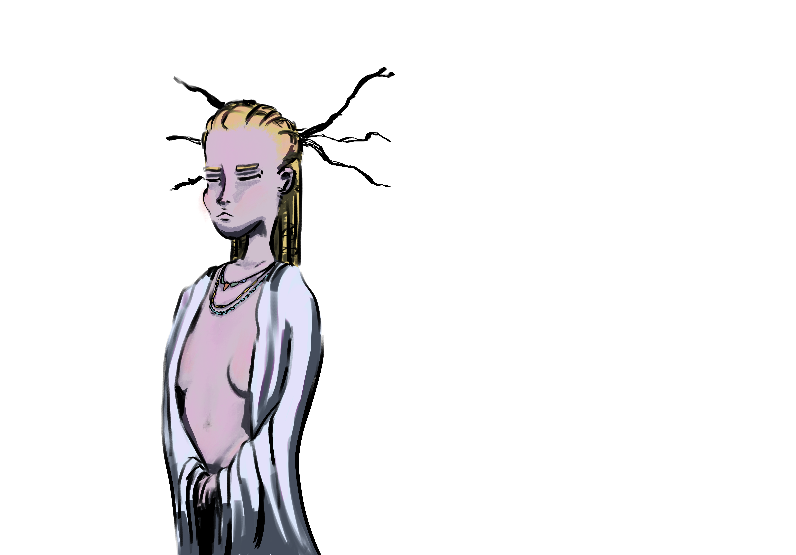
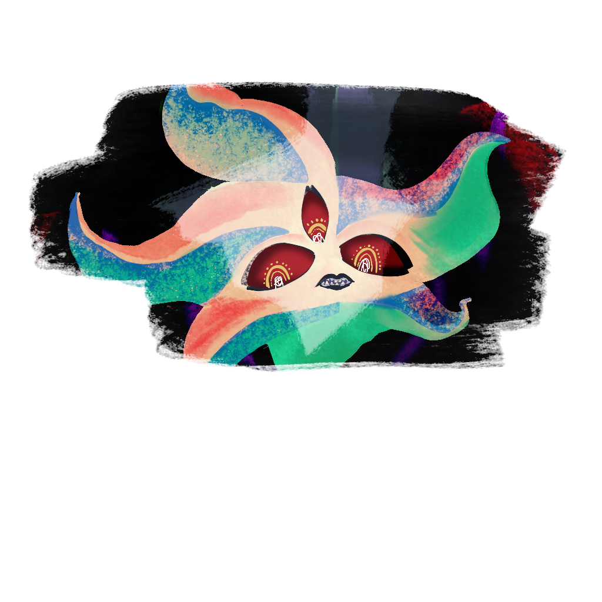

# Points of Interest

Galluvinchia is vast, and much of it remains uncharted. The East beyond the Lord of Carbohyrr is full of places yet to be discovered — the desert's heat keeps explorers away, and the sea is full of creatures that discourage sailing. But these known landmarks have drawn adventurers, scholars, and fools for generations.

---

## Ice Peak

*House of Giants · The Frozen North*

At the northernmost reaches of Galluvinchia, behind hungry winters and razor-sharp mountains, lies Ice Peak — the hidden stronghold of the giants. Even in the current age of the *Pax Aremedia*, armed warriors are regularly lost in the effort to reach this place and set limits on the giants' raids.

Long ago, the giants lived harmoniously in An'Ramoda. Then a choleric madness began to take some of them — a rage that threatened the city. Aremedia exiled them all to the far North, where her influence is limited.

*They have not forgotten.*

---

## Aurora Densasilva

*The Eternal Forest · The Twisted Wood*

{ .wiki-portrait }

At the heart of Galluvinchia sprawls Aurora Densasilva — the forever forest, the impenetrable, the ancient. It is said to be alive in ways no other forest is: its roots remember the First Age, and its branches hold grudges.

Inside its twisted roots, a civilization lives — not large in numbers, but rich in spirituality, guarded by the Will of the Wild. Only friends of the forest are welcome here. Treasure hunters and explorers are turned away, lost, or never seen again.

!!! quote ""
    *"Its hunger makes it endlessly grow. Political deals made with its inhabitants are rarely kept."*
    — Common saying

The forest is led, in serious matters, by the **Queen of Branches** — a herald of the Will of the Wild herself.

---

## The Breath of Sand

*The Eastern Desert · Last Oasis*

East of the Lord of Carbohyrr, where a jungle once stood in ages past, now lies an endless arid expanse: the Breath of Sand. Hidden within it is a small community living in the last green remnants — the last oasis, kept alive by the **Horangi family**, the last of an ancient felinfolk lineage with deep and mysterious connections to the land.

Ancient ruins dot the desert. What they once were — cities, temples, academies — is mostly forgotten.

---

## Ourobolis

*The Purple Sea · Where the Serpent Fell*

{ .wiki-portrait }

Far to the northeast, the sea around this island turned purple when the primordial snake **Aolosh** was vanquished by the ascending gods. The island is home to a tribe that still venerates the fallen serpent — their rituals are among the most extreme in Galluvinchia, fueled by the tainted blood of their fallen patron.

Brenadette watches this place with particular concern.

---

## The Mist

*Origin of the Elves · The Far East*

At the eastern edge of the known world, a permanent mist rolls. This is where the elves came from — or rather, where they retreated. They are part of legend now, rarely seen in the rest of Galluvinchia. The mist is described as a place of wonder and ecstasy, of shadows and magic. From outside it, one can only hear the resonance of something ancient and powerful.

> *"The elves have been here before any of us were even thought about."*
> — Juan Passage

---

## Ozan Tizuki

*The Elven Ruin · Once the Seat of Civilization*

Further east, past the mist, lie the ruins of what was once the greatest elven civilization Galluvinchia had ever seen. What happened to it is a mystery even the elves themselves can no longer remember.

---

## Ruins of Everaisle

*Forgotten Structure of the South*

Between Lakobordo and Lorda Gorda lie the ruins of a structure that no one can quite agree on: some say it was a church, others a cathedral, a town hall, or an academy. The truth has been lost to time. What remains is old stone and unanswered questions.

---

## The Silver Mines (Jewel of Evergrowth)

*Recently Opened · Source of the Island's New Prosperity*

The silver mine on the Jewel of Evergrowth was opened recently, and it has transformed the island — bringing new families, new merchants, and new prosperity. The mine is growing, and so is the island around it.

But the walls of the mine are not entirely silent.

---

## The Academies

Three academies have shaped the magical landscape of Galluvinchia — one standing in its glory, one thriving in its humble way, and one now lost to time.

### Academy of Magic Wonders
Located in the Lady of Marmaros, the most exclusive scholarship in Galluvinchia. Presided over by Magister Monica Mars, it produces multidisciplinary wizards considered among the finest minds in the world.

### Academy of Magic Waves and Dreams
On the cliffs of Doormi, this academy is more humble in focus but more generous in access — led by Merrion Meyer, it offers free first-year study for brilliant students. Its specialty lies in the Loom of Dreams and the weaving of magical garments.

### Academy of Infinite Travels *(Ruins)*
In the Febris Gulf lie the ruins of a once-great academy, long forgotten and now used occasionally as a hideout. The memories of ancient spells are said to linger in its stones. Whatever was studied here, much of it has been lost.
