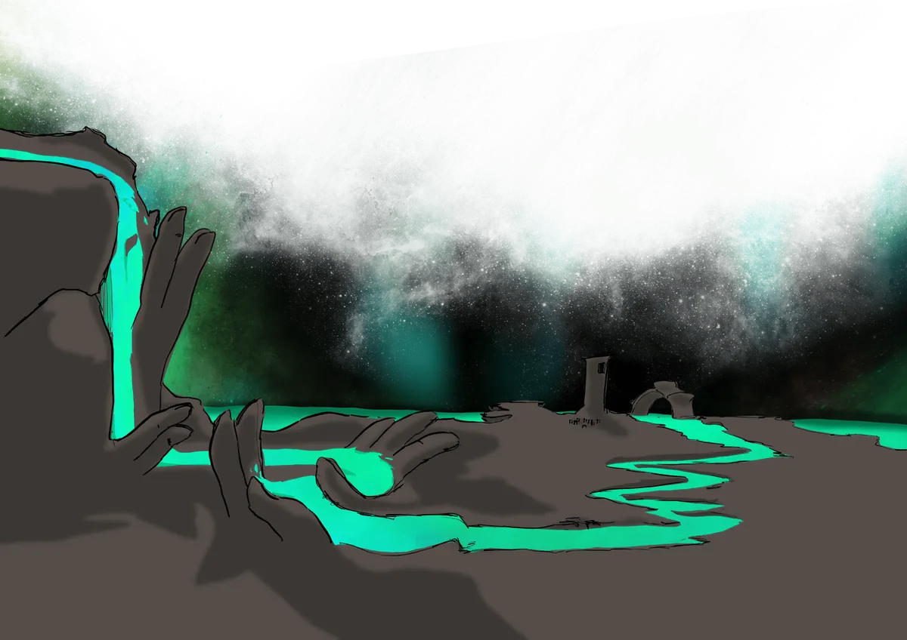

# Villages and Towns

Beyond the four great cities, Galluvinchia is dotted with towns and villages, each with its own character, its own patron, and its own secrets. Many roads connect them; not all are safe.

---

## Towns of An'Ramoda

The land surrounding An'Ramoda is loyal to the goddess and the city. These towns send their best fighters to seek Aremedia's favor, and their produce and craft sustain the great walled city.

### Picarosh

*The Gastronomy Village*

Nestled among the fields east of An'Ramoda, Picarosh is famous for its food above all else. Monthly cooking contests draw visitors from across the region, and the village takes its gastronomy with a seriousness that borders on the sacred.

---

### Craikov

*Port of An'Ramoda*

The sea gate of An'Ramoda. All maritime trade coming in and out of the great city passes through Craikov's docks. A rough, practical place, the kind where you mind your own business and keep moving.

---

### Saint Erensburg

*The Underground Gardens*

A town famous for its extraordinary underground gardens, carved and cultivated beneath the stone hills. The flowers that bloom in its artificial caverns are said to be found nowhere else in Galluvinchia.

---

### Tanishia

*Village of Vineyards*

The best wine in all of Galluvinchia comes from Tanishia. The golden hills surrounding the village are covered in vines, and the vintners here have been perfecting their craft for generations. A bottle of Tanishian wine can open many doors.

---

### Gretscznievlycov

*The Windmill Plains*

A quiet village of golden hills and windmills, whose flour feeds much of northern Galluvinchia. The sound of turning blades is constant here, the locals say it keeps the giants away.

---

## Jewel of Evergrowth

*Island Hamlet · Blessed by Leeve*

A hamlet growing under the shadow of the **First Tree**, the Jewel of Evergrowth is home to the goddess Leeve. It is a place where people can live free and simple lives, blessed with beautiful flowers and the gentlest nature.

Recently, a new silver mine opened on the island, and with it came growth: new families, new merchants, new visitors. The market is abundant and lively, and the island feels full of possibility.

But not all stories here are simple ones.

---

## Doormi

*The Village by the Waterfalls · Blessed by Morphia*

Doormi is a liberal and relaxed town situated on cliffs beside waterfalls, home to the **Academy of Magic Waves and Dreams**, led by Merrion Meyer. The academy offers the first year of study free for brilliant students, making magic more accessible than anywhere else in Galluvinchia.

The town is the biggest producer of **magical garments** and, notably, **mushrooms of every kind**. Its easygoing population attracts artists, healers, and anyone seeking knowledge or inner peace, though Morphia's Slumber sometimes dims the divine light that usually graces this place.

---

## Pharoes

*The Port of the South · Home of the Abbey of Brenadette*

Named for the great lighthouse that guides ships through stormy southern waters. Pharoes connects Lorda Gorda with the south of Galluvinchia, and many merchants use this port to bring their goods ashore.

The city is battered by constant storms, which has made Brenadette an even more immediate presence here, the locals revere her not only as goddess of death but as the **Goddess of the Tempest**. The largest Abbey of Brenadette in all of Galluvinchia stands in Pharoes.

Fishermen are as numerous as devout followers. It is said: *as many fish in the sea as prayers in the air.*

---

## Lakobordo

*The Commerce Hub · Heart of Galluvinchia's Roads*

South from Doormi, in the valley of the Lush Basin, lies Lakobordo, a city known for its gastronomy and its position at the crossroads of Galluvinchia. It connects Pharoes, Doormi, and the Lord of Carbohyrr with the North, making it the hub of overland trade across the continent.

Among its citizens, one baker named **Agustin of Carzagus** has become locally famous, not just for his extraordinary croissants, but for the mysterious silver pendant he carries, whose origin no one, including Agustin himself, can explain.

---

## An'Zulejosh

*The Tile City · Northern Coastal Port*

West from the Lady of Marmaros, surrounded by clay hills, An'Zulejosh is the main coastal port of the north. Its houses are decorated with colorful mosaic tiles, and the city is perpetually crowded with temporary visitors, a nexus between the Jewel of Evergrowth, An'Ramoda, and the Lady.

Merchants, sailors, and travelers all pass through. The stories told in its taverns span the breadth of Galluvinchia.

---

## Montebordo

*The Hidden Village · Followers of the Mountain*

Inside the walls of Carbohyrr, this small village strives to survive as its population slowly declines. After the Abbey of Brenadette was torn apart by flames, the locals found new hope in their own local deity: the goddess of the mountain.

Montebordo is remote and full of pagans, the kind of place one stumbles into rather than plans to visit.

---

## Rivabordo

*The Wood and Cheese Town*

In a peculiar corner of Galluvinchia, this small town is the main exporter of wood and cheese to the North. The surrounding forests are lush, the dairy farms are prolific, and the people, it is said, are among the most difficult to get along with in the land.

---

## Whisk of Lumin

*Gateway to the East · Tower of Vigil*

Founded by the legendary felinfolk hero **Lumin Oldreekia**, the first king of Lorda Gorda, the Whisk of Lumin stands as the main inland connection to the fortress island. Its towers watch the eastern horizon night and day, signaling when ghouls surge from the desert.

Recent tensions have arisen: Lorda Gorda is growing in power, and the ghoul attacks from the East are not stopping. The Whisk holds, for now.

---

## The Neverender

*The Realm Below · Final Rest of Souls*

{ .wiki-portrait }

Deep below the entrails of Galluvinchia lies the Neverender, the last destination for the souls of the living. Here, the river of souls meets its fate, joining the **Renewal** to become new souls, born again into bodies on the surface.

Tales tell of cities of echoes deep within, where shades share meals with the living who wander in searching for lost ones. Whether such stories are true, or merely consolation, is a question each traveler must answer for themselves.

Brenadette watches over this place, and has been bound to it since the Age of Gods.
